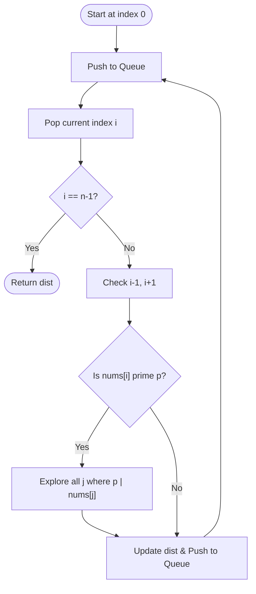

# Approach - Minimum Jumps via Prime Teleportation

| [Problem.md](Problem.md) | [Approach.md](Approach.md) | [Solution.cpp](Solution.cpp) | [Main.cpp](Main.cpp) |
| :---: | :---: | :---: | :---: |

---

> [!TIP]
> This problem is a shortest path search on a dynamic graph. By utilizing auxiliary nodes for primes or precomputing prime-to-index mappings, we can avoid the $O(N^2)$ trap of checking every teleportation pair.

---

## Technical Breakdown

### 1. Modeling the Jump Graph
The movement rules define a graph where each index is a node:
- **Adjacent Edges**: $(i \to i+1)$ and $(i \to i-1)$ with weight 1.
- **Teleportation Edges**: $(i \to j)$ with weight 1 if $nums[i]$ is prime $p$ and $p$ divides $nums[j]$.

### 2. Efficient BFS with Prime Mapping
A naive BFS checking all $j$ for a prime $p$ at every step would be too slow. Instead:
- **Sieve & SPF**: Use the Sieve of Eratosthenes to precompute primes up to $10^6$ and the Smallest Prime Factor (SPF) for each number.
- **Prime-to-Index Map**: Create a mapping where each prime $p$ points to a list of all indices $j$ such that $p$ divides $nums[j]$.
- **Visited Primes**: Maintain a `visited_prime` array. When we are at index $i$ and $nums[i]$ is prime, we process all indices in its mapping and then mark the prime as "exhausted." This ensures we only iterate through the multiples of each prime once.

### 3. BFS Execution
1. Initialize `dist` array with $-1$ and a queue with index $0$.
2. While processing index `curr`:
   - Check `curr-1` and `curr+1`.
   - If `nums[curr]` is prime $p$, explore all indices $j$ in `prime_to_indices[p]`.
   - Update `dist[next] = dist[curr] + 1` and push to queue.
3. The first time we reach $n-1$, we return the distance.

---

## Visual Representation

---

## Complexity Analysis

- **Time Complexity:** $O(N \cdot \omega(V) + V \log \log V)$
  - Sieve takes $O(V \log \log V)$ where $V = 10^6$.
  - Building the mapping takes $O(N \cdot \omega(V))$, where $\omega(V)$ is the number of distinct prime factors ($\le 7$).
  - BFS visits each index and each prime mapping at most once.
- **Auxiliary Space:** $O(N \cdot \omega(V) + V)$
  - To store the prime-to-indices mapping and the SPF/isPrime arrays.

---

> "The shortest distance between two points is often a path through the unseen factors that connect them."
> — *Mathematical Philosophy*

Happy Coding! 🚀

