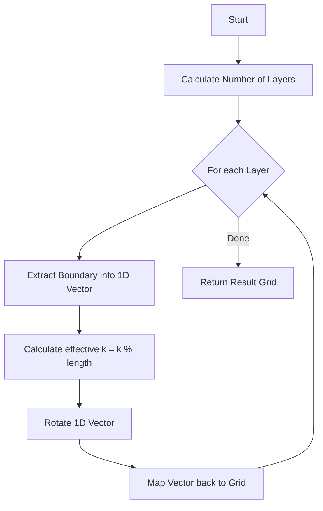

# [1914. Cyclically Rotating a Grid](https://leetcode.com/problems/cyclically-rotating-a-grid/)

| [Problem.md](./Problem.md) | [Approach.md](./Approach.md) | [Solution.cpp](./Solution.cpp) | [Main.cpp](./Main.cpp) |
| :--- | :--- | :--- | :--- |

---

> [!TIP]
> The key to grid rotation is decomposing the 2D problem into multiple independent 1D problems (layers). By flattening each layer, we can easily handle large $k$ using modulo arithmetic.

## Overview

The problem asks us to rotate each layer of an $m \times n$ matrix $k$ times in a counter-clockwise direction. Since the matrix dimensions are small ($50 \times 50$) but $k$ can be very large ($10^9$), the most efficient approach is to process each layer independently and use the property that a rotation of $L$ steps (where $L$ is the layer's perimeter) returns the layer to its original state.

## Deep Dive Logic

### 1. Identifying Layers
A matrix has $\min(m, n) / 2$ layers. Each layer can be defined by its top-left $(r1, c1)$ and bottom-right $(r2, c2)$ coordinates.
- Layer 0: $(0, 0)$ to $(m-1, n-1)$
- Layer 1: $(1, 1)$ to $(m-2, n-2)$
- ...and so on.

### 2. Extracting the Perimeter
For each layer, we traverse its boundary in a fixed order (e.g., top $\to$ right $\to$ bottom $\to$ left) to extract elements into a 1D array.
- Perimeter length $L = 2(r2 - r1 + 1) + 2(c2 - c1 + 1) - 4$.

### 3. Modulo Rotation
The effective rotation is $k \pmod L$. Rotating a 1D array counter-clockwise by $k$ is equivalent to shifting elements to the left by $k$ positions.

### 4. Re-insertion
After rotation, the 1D array is mapped back to the 2D grid using the same traversal order.

---

## Visual Logic Flow

---

## Complexity Analysis

- **Time Complexity:** $O(M \times N)$
  - We visit each element in the grid exactly twice: once to extract it and once to put it back.
- **Space Complexity:** $O(M + N)$
  - For each layer, we use a temporary 1D vector to store perimeter elements. The maximum perimeter size is approximately $2(M+N)$.

---

> "Rotation is not just a change in position, but a perspective shift in how we traverse space." — *Geometric Thinking*

# Happy Coding! 🚀

