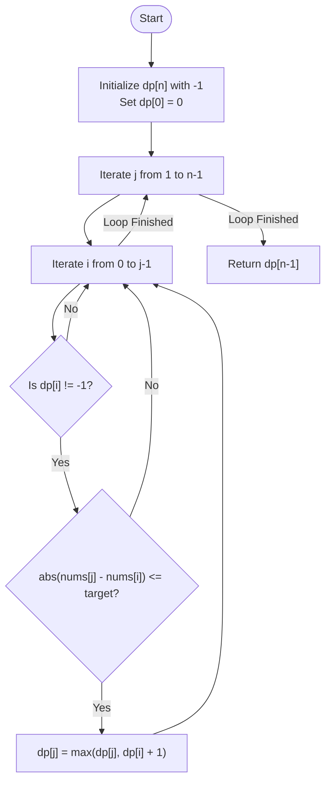

# Maximum Number of Jumps - Approach

| [Problem.md](Problem.md) | [Approach.md](Approach.md) | [Solution.cpp](Solution.cpp) | [Main.cpp](Main.cpp) |
| :--- | :--- | :--- | :--- |

---

> [!TIP]
> This problem asks for the *maximum* number of steps to reach a target. In directed acyclic scenarios where we can jump forward, Dynamic Programming is the ideal choice to build upon previous optimal sub-problems.

---

## Technical Deep Dive

The problem can be modeled as finding the longest path in a Directed Acyclic Graph (DAG) where nodes are indices and edges exist if the jump condition is met.

### 1. State Definition
Let $dp[i]$ represent the maximum number of jumps possible to reach index $i$ starting from index $0$.

### 2. Base Case
- $dp[0] = 0$: We start at index 0, so it takes 0 jumps to reach it.
- $dp[i] = -1$: For all $i > 0$, initialize as -1 to represent that the index is currently unreachable.

### 3. State Transition
For each index $j$ (from 1 to $n-1$), we look at all previous indices $i$ (from 0 to $j-1$).
If index $i$ is reachable ($dp[i] \neq -1$) and the condition is satisfied:
$$-target \leq nums[j] - nums[i] \leq target$$
Then we can update $dp[j]$:
$$dp[j] = \max(dp[j], dp[i] + 1)$$

### 4. Final Answer
The answer is stored in $dp[n-1]$. If $dp[n-1]$ remains -1, it means the last index is unreachable.

---

## Visual Representation

### Logic Flow

---

## Complexity Analysis

- **Time Complexity**: $O(n^2)$
    - We have nested loops where the outer loop runs $n$ times and the inner loop runs up to $n$ times.
- **Space Complexity**: $O(n)$
    - We use a single array `dp` of size $n$.

---

> "The longest journey begins with a single jump, but the smartest journey jumps through the right hoops." — Real-life adaptation

Happy Coding! 🚀

