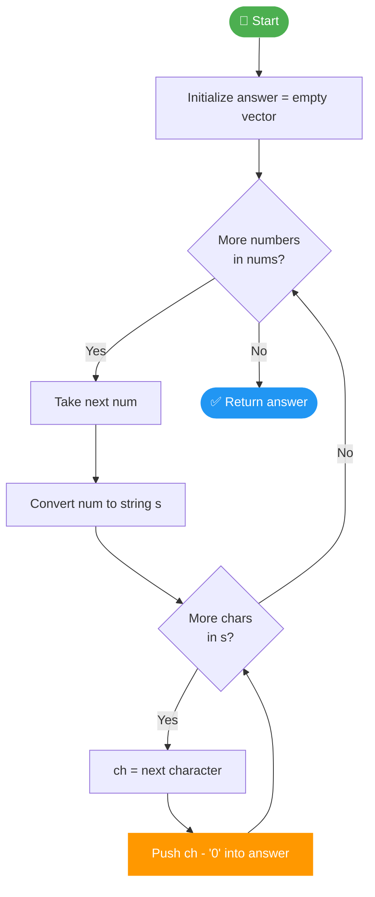
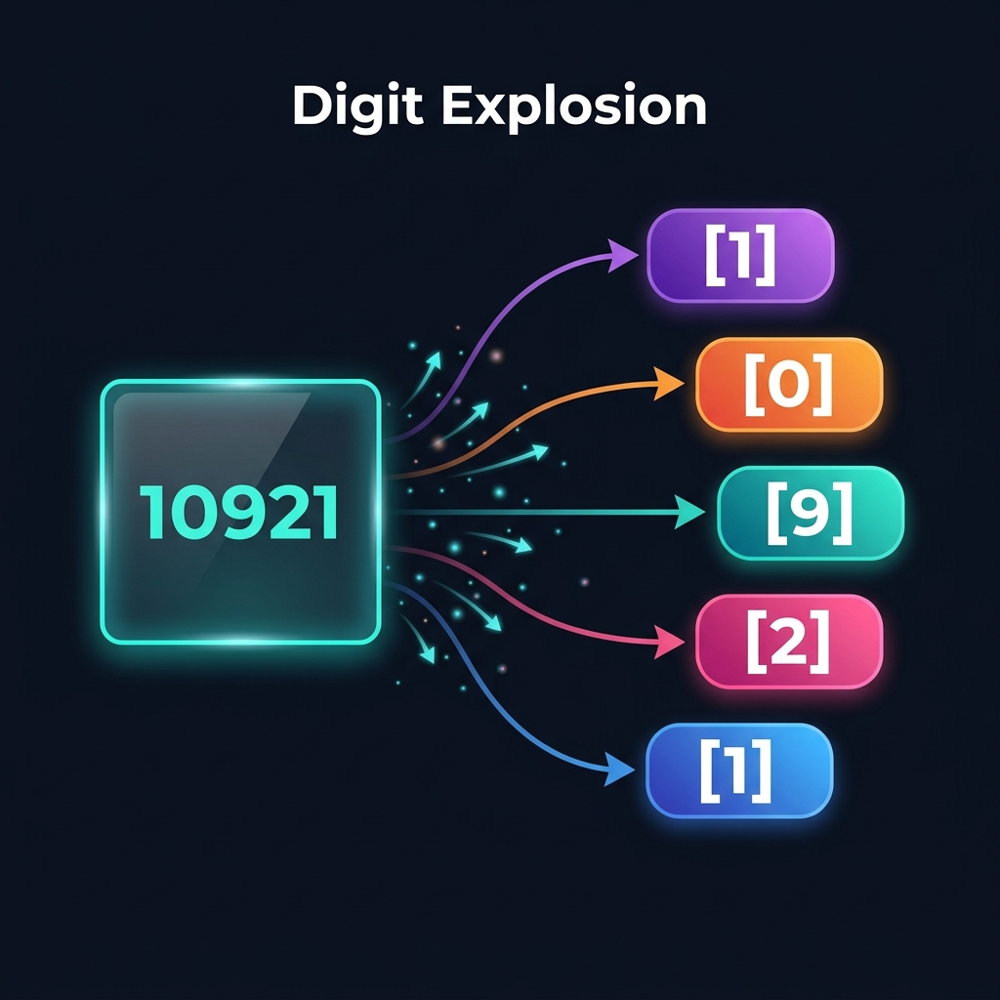

# 💡 Approach — Separate the Digits in an Array


| 📄 [Problem](Problem.md) | 💡 [Approach](Approach.md) | 🧠 [Solution](Solution.cpp) | 🚀 [Main](Main.cpp) |
|:---:|:---:|:---:|:---:|


---

> [!TIP]
> **Core Insight:** Converting an integer to its string form gives you immediate, ordered access to each digit as a character — no reversal needed. A single pass of `ch - '0'` transforms it back into an integer digit. This is the simplest, most readable simulation pattern for digit extraction.

---

## 🧠 Intuition

When we see a number like `10921`, we want `[1, 0, 9, 2, 1]`.

The digits are already laid out **left-to-right** in the number's decimal representation. The simplest way to access them in order is to treat the number as a **string**, iterate character by character, and convert each `'0'–'9'` character to its integer value.

This avoids the classic pitfall of the **modulo-reversal** trick (`num % 10`, `num / 10`), which extracts digits in **reverse** order and requires an extra reversal step.

---

## 🔢 Step-by-Step Breakdown

### Input: `nums = [13, 25, 83, 77]`

| Step | Number | String Form | Digits Extracted | answer (so far)        |
|------|--------|-------------|------------------|------------------------|
| 1    | 13     | `"13"`      | `[1, 3]`         | `[1, 3]`               |
| 2    | 25     | `"25"`      | `[2, 5]`         | `[1, 3, 2, 5]`         |
| 3    | 83     | `"83"`      | `[8, 3]`         | `[1, 3, 2, 5, 8, 3]`   |
| 4    | 77     | `"77"`      | `[7, 7]`         | `[1, 3, 2, 5, 8, 3, 7, 7]` |

### Final Output: `[1, 3, 2, 5, 8, 3, 7, 7]` ✅

---

## 🔄 Algorithm Walkthrough

```
separateDigits(nums):
  answer ← []

  FOR each num IN nums:
    s ← to_string(num)          // "83"

    FOR each character ch IN s:
      answer.push_back(ch - '0') // '8' - '0' = 8, '3' - '0' = 3

  RETURN answer
```

**Why `ch - '0'` works:**
ASCII codes are sequential. `'0'` = 48, `'1'` = 49, ..., `'9'` = 57.
So `'8' - '0'` = `56 - 48` = `8`. ✔

---

## 🌊 Mermaid Flowchart



---

## 📊 Complexity Analysis

| Metric           | Value         | Reasoning                                                       |
|------------------|---------------|-----------------------------------------------------------------|
| **Time**         | `O(n · d)`    | `n` numbers, each with at most `d` digits (`d ≤ 6` for 10^5)  |
| **Space**        | `O(n · d)`    | Output vector holds all extracted digits                        |
| **Auxiliary**    | `O(d)`        | Temporary string per number (overwritten each iteration)        |

For the given constraints (`n ≤ 1000`, `nums[i] ≤ 10^5 → d ≤ 6`), this is effectively **O(6000) ≈ O(1)** in practice — extremely fast.

---

## 🆚 Alternative Approaches

| Method                  | Order Preserved? | Extra Reversal? | Recommended? |
|-------------------------|------------------|-----------------|--------------|
| **String Conversion** ✅ | Yes (naturally) | No              | ✔ Best       |
| Modulo Extraction        | Reversed         | Yes             | ✗ More code  |
| Digit Array Precompute   | Yes              | No              | ~ Overkill   |

---

## 🖼️ Premium Visualization


*Visual: The number `10921` exploding into its individual digits `[1, 0, 9, 2, 1]` — each digit extracted left-to-right via string traversal.*

---

> *"Simplicity is the ultimate sophistication."*
> — **Leonardo da Vinci**

---


|Happy Coding! 🚀
|:---:|
