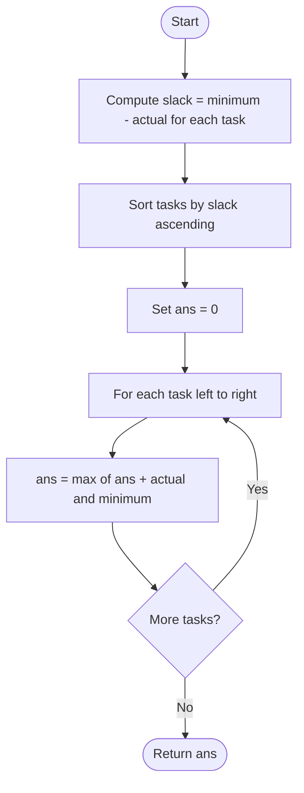

# 💡 Approach — Minimum Initial Energy to Finish Tasks

<div align="center">

| [Problem.md](Problem.md) | [Approach.md](Approach.md) | [Solution.cpp](Solution.cpp) | [Main.cpp](Main.cpp) |
| :---: | :---: | :---: | :---: |

</div>

---

> [!TIP]
> **Core Insight — Exchange Argument (Greedy Proof):**
> Consider any two adjacent tasks A = [a, m] and B = [b, n].
> Doing A then B requires initial energy `max(m, a + n)`.
> Doing B then A requires initial energy `max(n, b + m)`.
> A should come **before** B when `m - a <= n - b`, i.e., A's
> **slack** (minimum − actual) is smaller than B's slack.
> Therefore: **sort by slack ascending** — small-slack tasks first,
> large-slack tasks last. Then one left-to-right sweep computes the answer.

---

## 🎯 Why Greedy Works Here

The problem asks for an optimal **ordering** of tasks. Whenever ordering problems appear with `O(n log n)` expectations, a greedy exchange argument is the go-to tool.

**Slack = minimum − actual** measures how "buffer-hungry" a task is relative to its true cost. A task with a large slack means: "I require a lot to start, but I don't cost that much." Such a task is best done **late** — when accumulated energy is already large from previous tasks.

---

## 🔩 Step-by-Step Breakdown

### Step 1 — Define Slack and Sort

For each task `[actual, minimum]`:

```
slack = minimum - actual   (always >= 0 since actual <= minimum)
```

Sort all tasks by `slack` **ascending** (smallest slack first).

```
tasks = [[1,2],[2,4],[4,8]]
slacks = [1, 2, 4]   → already sorted ascending
```

### Step 2 — Left-to-Right Sweep

Sorted ascending by slack means the task at index 0 has the smallest slack and is executed **first**. Sweep left-to-right maintaining:

```
ans = max(ans + actual[i], minimum[i])
```

`ans` is the minimum energy needed before task `i`, given that all tasks `i+1..n-1` still need to be done after it. At each step: we need at least `minimum[i]` to unlock task `i`, and at least `ans + actual[i]` so that after spending `actual[i]` we still have `ans` left for the suffix.

```
Sorted ascending: [[1,2], [2,4], [4,8]]

ans = 0
i=0: [1,2]  → ans = max(0+1,  2) = 2
i=1: [2,4]  → ans = max(2+2,  4) = 4
i=2: [4,8]  → ans = max(4+4,  8) = 8  ✓
```

### Step 3 — Verify Example 2

```
tasks = [[1,3],[2,4],[10,11],[10,12],[8,9]]
slacks =   2,    2,     1,      2,     1

Sort ascending by slack:
  [10,11](1), [8,9](1), [1,3](2), [2,4](2), [10,12](2)

Left-to-right sweep:
ans = 0
[10,11]: ans = max(0+10,  11) = 11
[8,9]  : ans = max(11+8,  9)  = 19
[1,3]  : ans = max(19+1,  3)  = 20
[2,4]  : ans = max(20+2,  4)  = 22
[10,12]: ans = max(22+10, 12) = 32  ✓
```

---

## 🔄 Mermaid Flowchart



---

## 🖼️ Premium Visualization

```
Sorted by slack ascending (small slack = expensive to unlock → do first):

Index:   0          1         2         3          4
Task:  [10,11]    [8,9]    [1,3]    [2,4]     [10,12]
Slack:    1         1        2        2           2

Execution order (left → right):
 [10,11] → [8,9] → [1,3] → [2,4] → [10,12]

ans sweep:
  0 →(+10, min 11)→ 11 →(+8, min 9)→ 19 →(+1, min 3)→ 20
    →(+2, min 4)→ 22 →(+10, min 12)→ 32

Answer = 32 ✓
```

---

## 📊 Complexity Analysis

| Phase     | Time           | Space    |
|-----------|----------------|----------|
| Sort      | $O(n \log n)$  | $O(1)$   |
| Sweep     | $O(n)$         | $O(1)$   |
| **Total** | $O(n \log n)$  | $O(1)$   |

---

## ⚙️ Key Implementation Notes

1. **Sort comparator:** `(a[1]-a[0]) < (b[1]-b[0])` — ascending slack.
2. **Recurrence:** `ans = max(ans + actual, minimum)` — ensures we satisfy both the minimum threshold and the accumulated chain requirement.
3. **No extra space:** sort is in-place, sweep uses a single `int`.
4. **Ties in slack:** order among ties doesn't affect correctness (the recurrence is symmetric for equal-slack tasks).

---

> *"In every walk with nature, one receives far more than he seeks."*
> — **John Muir** (on greedy: take what you need, nothing more)

---

<div align="center">
Happy Coding! 🚀
</div>
