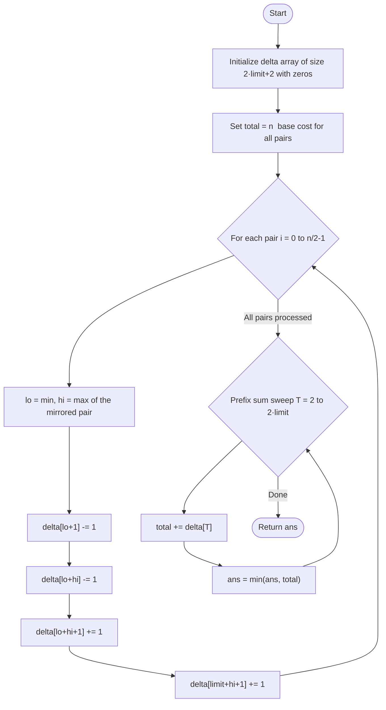
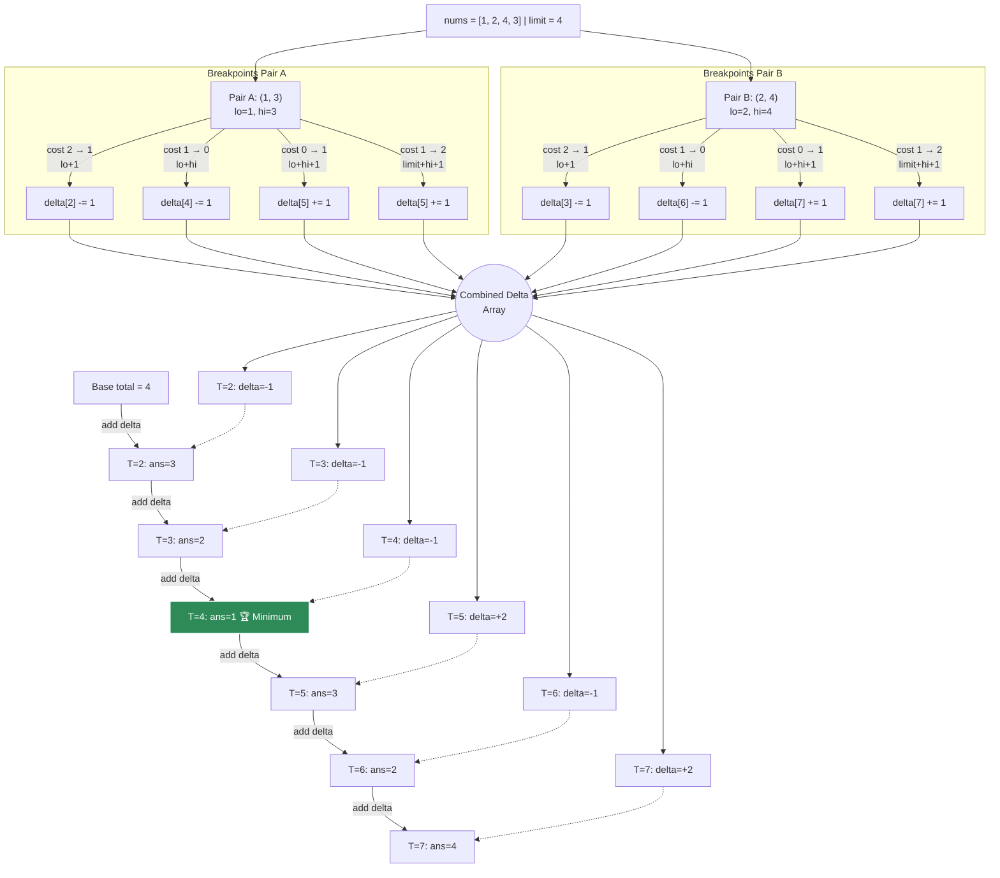

# 💡 Approach — Minimum Moves to Make Array Complementary

<div align="center">

| 📄 [Problem](./Problem.md) | 💡 [Approach](./Approach.md) | 🧩 [Solution](./Solution.cpp) | 🚀 [Main](./Main.cpp) |
|:--------------------------:|:-----------------------------:|:------------------------------:|:---------------------:|

</div>

---

## 📊 Metadata


---

> [!TIP]
> **Core Insight:** For each mirrored pair `(a, b)`, the cost to achieve a target sum `T`
> is a **step function** with at most 4 breakpoints. Instead of evaluating every `T` per pair
> (O(n·limit)), we accumulate those breakpoints into a **difference array** and recover the
> minimum with a single prefix-sum sweep — yielding **O(n + limit)** overall.

---

## 🎯 Why Not Brute Force?

| Approach | Time | Notes |
|---|---|---|
| Try every T for every pair | $O(n \cdot \text{limit})$ | TLE for $n, \text{limit} = 10^5$ |
| Sorting + greedy | Does not apply cleanly | Pairs are interdependent |
| **Difference Array + Prefix Sum** ✅ | $O(n + \text{limit})$ | Optimal; 4 breakpoints per pair |

---

## 🔩 Step-by-Step Breakdown

### Step 1 — Understand a Single Pair

For each symmetric pair `(nums[i], nums[n-1-i])`:

```
lo = min(a, b),   hi = max(a, b)

Cost to achieve target sum T:
  ┌─────────────────────────────────────────────────────┐
  │  T in [2, lo]              →  2 moves (change both)     │
  │  T in [lo+1, lo+hi-1]     →  1 move  (change lo)        │
  │  T = lo+hi                 →  0 moves (already done).   │
  │  T in [lo+hi+1, limit+hi] →  1 move  (change hi)        │
  │  T in [limit+hi+1,2*limit]→  2 moves (change both)      │
  └─────────────────────────────────────────────────────┘
```

This cost function has exactly **4 breakpoints**: `lo+1`, `lo+hi`, `lo+hi+1`, `limit+hi+1`.

### Step 2 — Build the Difference Array

Start with total cost `= n` (n/2 pairs × 2 base moves each).  
For each pair `(lo, hi)`, apply delta changes at breakpoints:

```
delta[lo + 1]        -= 1    // cost 2 → 1 starts here
delta[lo + hi]       -= 1    // cost 1 → 0  (perfect sum)
delta[lo + hi + 1]   += 1    // cost 0 → 1  (past perfect)
delta[limit + hi + 1]+= 1    // cost 1 → 2  (out of range)
```

### Step 3 — Prefix Sum Sweep

Scan `T` from `2` to `2·limit`. At each `T`:

```cpp
total += delta[T];
ans    = min(ans, total);
```

The running `total` always equals the exact number of moves for target `T`.

---

## 🔄 Mermaid Flowchart



---

## 🖼️ Premium Visualization



---

## 📊 Complexity Analysis

| Phase | Time | Space |
|---|---|---|
| Build delta (n/2 pairs) | $O(n)$ | $O(\text{limit})$ |
| Prefix sum sweep | $O(\text{limit})$ | $O(1)$ |
| **Overall** | $O(n + \text{limit})$ | $O(\text{limit})$ |

---

## ⚙️ Key Implementation Notes

1. **Delta array size** — `2 * limit + 2` to safely accommodate index `limit+hi+1` (max = `2·limit+1`).
2. **Base cost = n** — `n/2` pairs, each costing 2 moves initially; using `n` simplifies the accumulation.
3. **Breakpoint at `lo+hi`** — the `-1` at `lo+hi` (not `lo+hi-1`) ensures `T = lo+hi` itself costs 0 (the transition point is inclusive on the left).
4. **No floating-point** — pure integer arithmetic throughout; no risk of precision issues.
5. **Valid T range** — only sweep `T` from `2` (minimum possible sum: `1+1`) to `2·limit` (maximum: `limit+limit`).

---

> *"The ability to simplify means to eliminate the unnecessary so that the necessary may speak."*  
> — **Hans Hofmann**, Artist & Educator

---
<div align="center">
<h2>Happy Coding! 🚀</h2>
<a href="../105_Day/Approach.md">
  
</a>
<a href="https://x.com/PankajB42550" target="_blank">
  
</a>
<a href="../107_Day/Approach.md">
  
</a>
</div>
