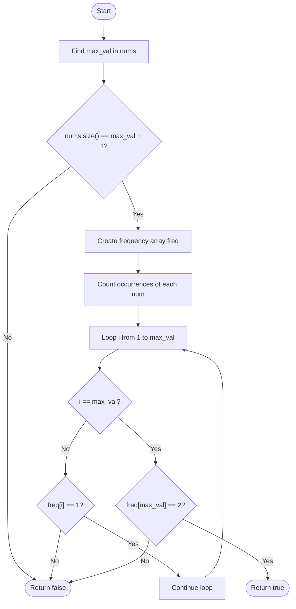
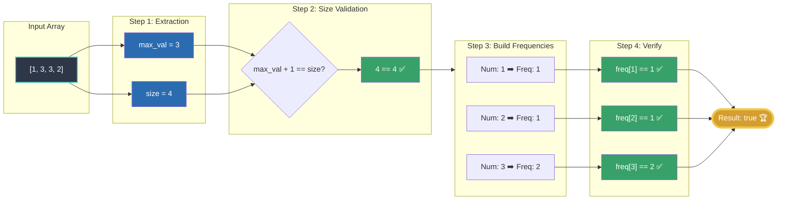

# 💡 Approach — Check if Array is Good

| 📄 [Problem](./Problem.md) | 💡 [Approach](./Approach.md) | 🧩 [Solution](./Solution.cpp) | 🚀 [Main](./Main.cpp) |
|:--------------------------:|:-----------------------------:|:------------------------------:|:---------------------:|

---
## 📊 Metadata

---

> [!TIP]
> **Core Insight:** A "good" array must be exactly a permutation of `[1, 2, ..., n-1, n, n]`. 
> The maximum element $n$ directly dictates the expected size of the array ($n + 1$). 
> Instead of sorting, we can use a frequency map to count occurrences in $O(N)$ time and verify that elements $1$ to $n-1$ appear exactly once, and $n$ appears exactly twice.

---

## 🎯 Why Not Brute Force?

| Approach | Time | Notes |
|---|---|---|
| Sorting | $O(N \log N)$ | Sort the array and compare index by index. Simple but slightly slower. |
| **Frequency Array** ✅ | $O(N)$ | Optimal; uses an array to count frequencies in linear time. |

---

## 🔩 Step-by-Step Breakdown

### Step 1 — Find the Maximum Value
Determine the maximum element `max_val` in the array `nums`. This value acts as our $n$.

### Step 2 — Check the Size
A valid array based on $n$ must have exactly $n + 1$ elements.
- If `nums.size() != max_val + 1`, immediately return `false`.

### Step 3 — Build a Frequency Map
Create a frequency array (or vector) to count the occurrences of each element in `nums`.

### Step 4 — Verify Frequencies
Iterate from $i = 1$ to `max_val`:
- If $i < \text{max\_val}$ and `freq[i] != 1`, return `false`.
- If $i == \text{max\_val}$ and `freq[i] != 2`, return `false`.

If all checks pass, the array is a valid permutation and we return `true`.

---

## 🔄 Mermaid Flowchart

---

## 🖼️ Premium Visualization

---

## 📊 Complexity Analysis

| Phase | Time | Space |
|---|---|---|
| Finding Maximum | $O(N)$ | $O(1)$ |
| Building Frequency | $O(N)$ | $O(N)$ to store frequencies |
| Verification | $O(N)$ | $O(1)$ |
| **Overall** | $O(N)$ | $O(N)$ |

> **Note:** Because $N \leq 100$ and $\text{nums}[i] \leq 200$, the frequency array requires negligible space, making this extremely efficient.

---

## ⚙️ Key Implementation Notes

1. **Size check is vital:** Arrays like `[3, 4, 4, 1, 2, 1]` might fail instantly on the length check, bypassing the need to even build the frequency map.
2. **Out of bounds:** If an element exceeds $n$ (our `max_val`), the size check implicitly protects us, or our frequency map handles it properly by setting an upper bound. 

---

> *"Data structures are the logic of space; algorithms are the logic of time."*  
> — **Anonymous**

---

<h2>Happy Coding! 🚀</h2>

