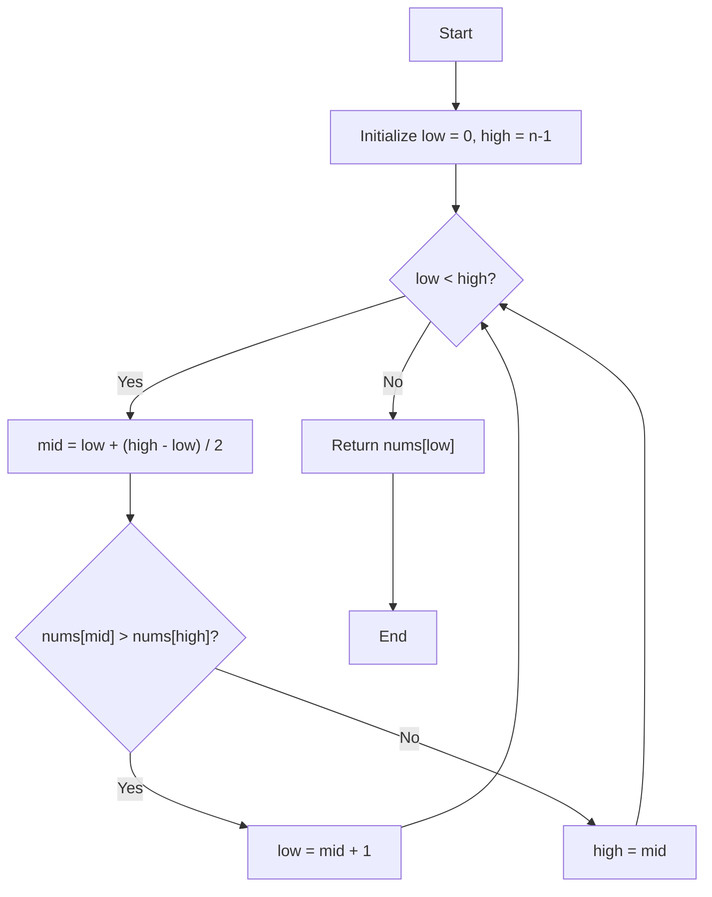

# 💡 Approach — Find Minimum in Rotated Sorted Array

| 📄 [Problem](./Problem.md) | 💡 [Approach](./Approach.md) | 🧩 [Solution](./Solution.cpp) | 🚀 [Main](./Main.cpp) |
|:--------------------------:|:-----------------------------:|:------------------------------:|:---------------------:|

---

## 📊 Metadata

---

## 🧩 Problem Description
> [!TIP]
> **Core Insight:** In a rotated sorted array, the minimum element is the only element that is smaller than its predecessor. Using binary search, we can identify which half of the array contains this "inflection point" by comparing the middle element with the rightmost element.

---
## 🔩 Step-by-Step Breakdown
1.  **Initialize Pointers:** Set `low` to 0 and `high` to $n - 1$.
2.  **Binary Search Loop:** While `low < high`:
    - Calculate `mid = low + (high - low) / 2`.
    - **Check Right Half:** If `nums[mid] > nums[high]`, the minimum element must be in the right half (excluding `mid`) because the "break" in sorted order occurs after `mid`. Update `low = mid + 1`.
    - **Check Left Half:** Otherwise, the minimum element is either at `mid` or in the left half. Update `high = mid`.
3.  **Return Result:** Once the loop terminates, `low` and `high` will converge at the minimum element's index. Return `nums[low]`.

---

## 🔄 Mermaid Flowchart

---

## 📊 Complexity Analysis
| Type | Complexity | Description |
| :--- | :--- | :--- |
| **Time Complexity** | $O(\log n)$ | Each iteration halves the search space using binary search. |
| **Space Complexity** | $O(1)$ | No extra space is used except for a few variables. |

---

> *"The only way to learn a new programming language is by writing programs in it."*

---

<h2>Happy Coding! 🚀</h2>

