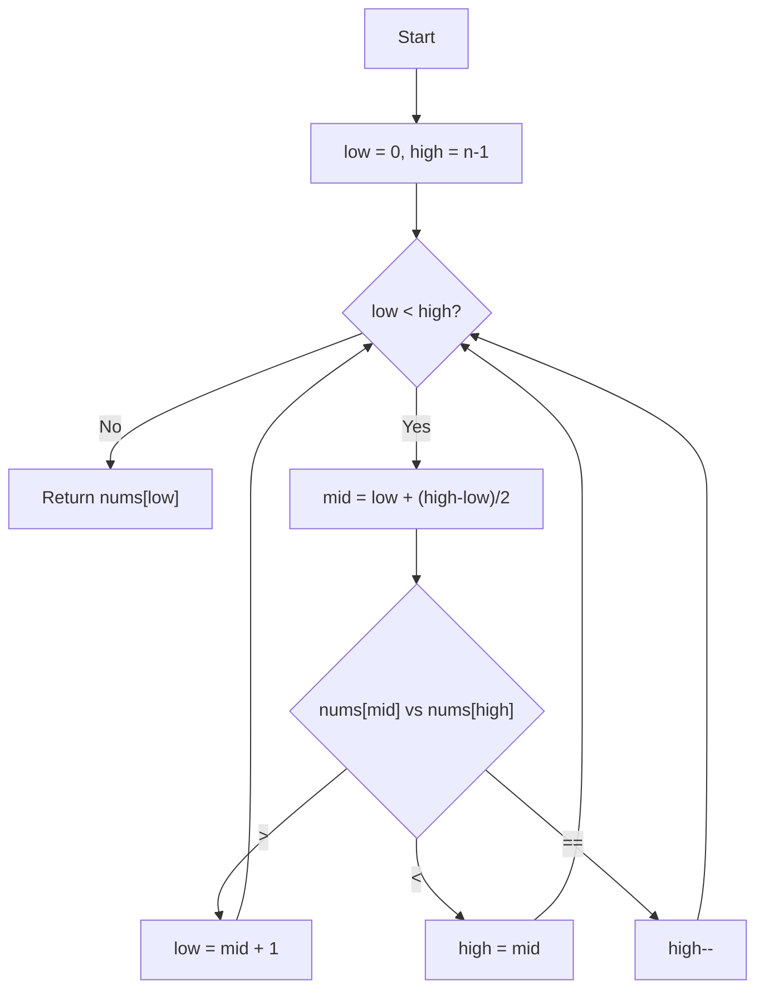

# 💡 Approach — Find Minimum in Rotated Sorted Array II

| 📄 [Problem](./Problem.md) | 💡 [Approach](./Approach.md) | 🧩 [Solution](./Solution.cpp) | 🚀 [Main](./Main.cpp) |
|:--------------------------:|:-----------------------------:|:------------------------------:|:---------------------:|

---

## 📊 Metadata

---

> [!TIP]
> **Core Insight:** In a rotated sorted array, the minimum element is the only one where the previous element is greater than it. With duplicates, if `nums[mid] == nums[high]`, we cannot determine which side the minimum lies on, so we safely decrement `high` to narrow the search space.

---

## 🔩 Step-by-Step Breakdown
1. **Initialize Pointers:** Set `low = 0` and `high = n - 1`.
2. **Binary Search Loop:** While `low < high`:
   - Calculate `mid = low + (high - low) / 2`.
   - **Case 1:** If `nums[mid] > nums[high]`, the minimum must be in the right half (excluding `mid`). Set `low = mid + 1`.
   - **Case 2:** If `nums[mid] < nums[high]`, the minimum is either at `mid` or in the left half. Set `high = mid`.
   - **Case 3 (Duplicates):** If `nums[mid] == nums[high]`, we don't know the side. Safely decrement `high` to reduce search space.
3. **Return Result:** When the loop terminates, `low` points to the minimum element.

---

## 🔄 Mermaid Flowchart

---

## 📊 Complexity Analysis
| Type | Complexity | Description |
| :--- | :--- | :--- |
| **Time Complexity** | $$O(\log n)$$ | Average case is logarithmic. In the worst case (all elements same), it degrades to $$O(n)$$. |
| **Auxiliary Space** | $$O(1)$$ | Only a few variables are used. |

---

> *"Optimization is not about doing things faster, but about doing fewer unnecessary things."*

---

  <h3>Happy Coding! 🚀</h3>

