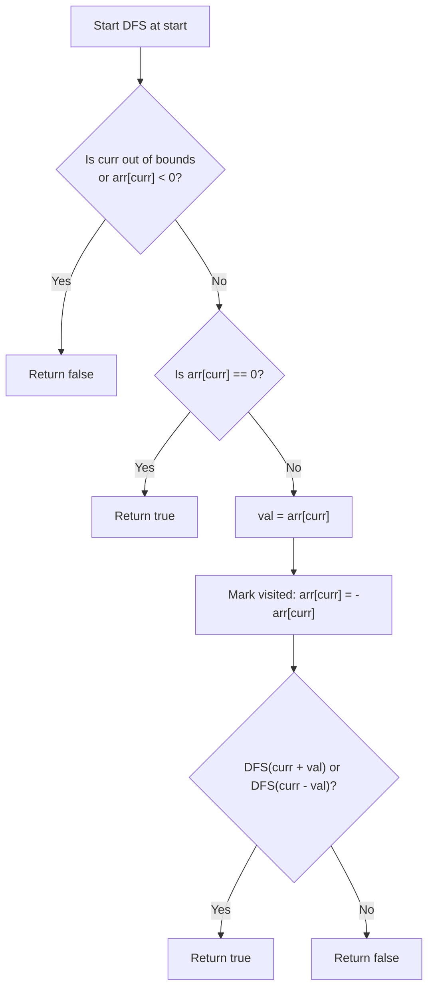

# 💡 Approach — Jump Game III

| 📄 [Problem](./Problem.md) | 💡 [Approach](./Approach.md) | 🧩 [Solution](./Solution.cpp) | 🚀 [Main](./Main.cpp) |
|:--------------------------:|:-----------------------------:|:------------------------------:|:---------------------:|

---

## 📊 Metadata

---
> [!TIP]
> **Core Insight:** The problem describes a graph traversal scenario where each index is a node and its allowed jumps `i + arr[i]` and `i - arr[i]` are directed edges. Either **DFS** or **BFS** can explore all reachable nodes. To achieve $$O(1)$$ auxiliary space (excluding recursion stack), we can track visited nodes **in-place** by negating the values in `arr`. Since `0` represents success, we immediately return `true` before negating it, making this negation technique 100% correct!

---

## 🔩 Step-by-Step Breakdown
1. **Base Cases and Out-of-Bounds Check:** If the current index `curr` is out of the array bounds (`curr < 0` or `curr >= arr.size()`), or if the index has already been visited (indicated by `arr[curr] < 0`), return `false`.
2. **Success Check:** If `arr[curr] == 0`, we have successfully reached a zero value. Return `true`.
3. **Mark as Visited:** Store the current jump distance `val = arr[curr]`, and mark the current index as visited by negating `arr[curr] = -arr[curr]`.
4. **Recursive Exploration:** Recursively check if a zero can be reached by jumping forward to `curr + val` or backward to `curr - val`.
5. **Return Result:** Return `true` if either of the recursive paths finds a zero, otherwise return `false`.

---

## 🔄 Mermaid Flowchart

---

## 📊 Complexity Analysis
| Type | Complexity | Description |
| :--- | :--- | :--- |
| **Time Complexity** | $$O(n)$$ | In the worst case, we will visit every index at most once, performing $$O(1)$$ work per node. |
| **Auxiliary Space** | $$O(n)$$ | The space is dominated by the recursion stack of Depth-First Search, which can go up to depth $$n$$ in a linear path. We optimize memory usage to $$O(1)$$ extra space by marking nodes visited in-place. |

---

> *"The shortest way to do many things is to do only one thing at a time."*

---

  <h3>Happy Coding! 🚀</h3>

