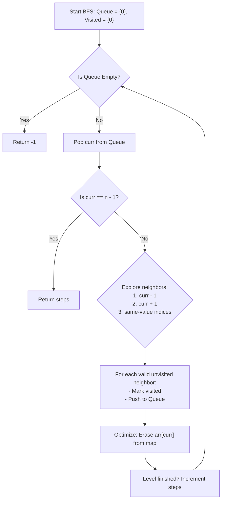

# 💡 Approach — Jump Game IV

| 📄 [Problem](./Problem.md) | 💡 [Approach](./Approach.md) | 🧩 [Solution](./Solution.cpp) | 🚀 [Main](./Main.cpp) |
|:--------------------------:|:-----------------------------:|:------------------------------:|:---------------------:|

---

## 📊 Metadata

---
> [!TIP]
> **Core Insight:** We can model this problem as finding the shortest path in an unweighted graph where indices are nodes and jump options are edges. A standard Breadth-First Search (BFS) is perfect for finding the minimum steps. However, a naive BFS will TLE if we have many duplicate elements (e.g. `[7, 7, ..., 7]`) since we'd repeatedly traverse identical index lists. By storing the indices of duplicates in a hash map and **clearing/erasing** each value's entry in the map as soon as we jump to its identical neighbors, we guarantee that each node and edge is processed at most once, reducing the complexity to a highly optimal $$O(n)$$ time and space!

---

## 🔩 Step-by-Step Breakdown
1. **Value-to-Index Mapping:** Build an adjacency-like map (`unordered_map<int, vector<int>>`) storing all indices corresponding to each unique value in the array. This allows us to jump to same-value elements in $$O(1)$$ lookup time.
2. **BFS Queue & Visited Initialization:** Initialize a BFS queue `q` starting at index `0` and a `visited` boolean array/vector to prevent reprocessing nodes and infinite cycles.
3. **Level-by-Level Traversal:** Process the graph level-by-level (using standard queue-size iteration). Keep track of the number of `steps` taken.
4. **Neighbor Exploration:** For each popped index `curr`, if it is `n - 1`, we immediately return `steps`. Otherwise, explore all three valid jump neighbors:
   - Backward jump: `curr - 1` (if $$\ge 0$$ and unvisited).
   - Forward jump: `curr + 1` (if $$< n$$ and unvisited).
   - Equal-value jump: Any index `j` from the mapping where `arr[j] == arr[curr]` (if unvisited).
5. **Redundant Check Optimization:** Crucially, once we visit all neighbors with value `arr[curr]`, delete `arr[curr]` from our hash map. This ensures we never traverse those indices again, avoiding $$O(n^2)$$ TLE on cases like all elements being equal.

---

## 🔄 Mermaid Flowchart

---

## 📊 Complexity Analysis
| Type | Complexity | Description |
| :--- | :--- | :--- |
| **Time Complexity** | $$O(n)$$ | Each index is pushed/popped from the queue at most once. The map lookup and erase operation run in $$O(1)$$ average time. Clearing the map entry ensures each equal-value list is traversed at most once. |
| **Auxiliary Space** | $$O(n)$$ | The hash map, queue, and visited array/vector all take $$O(n)$$ space in the worst case to store the array elements and indices. |

---

> *"The secret of getting ahead is getting started. The secret of getting started is breaking your complex overwhelming tasks into small manageable tasks, and starting on the first one."* — Mark Twain

---

  <h3>Happy Coding! 🚀</h3>

