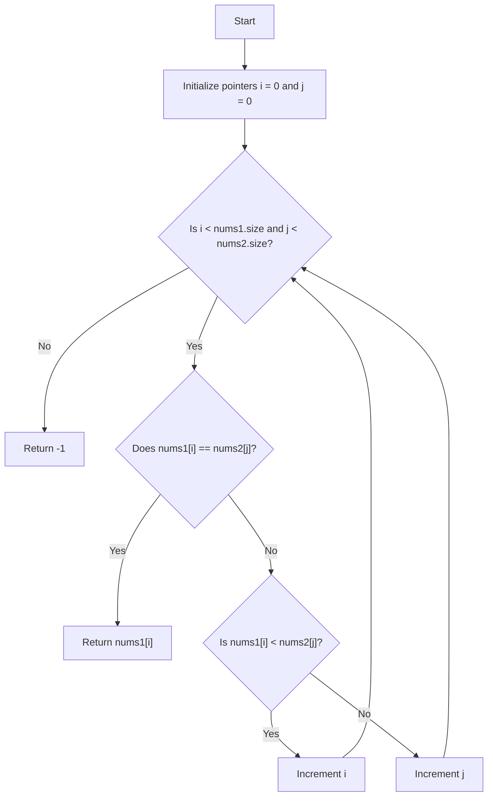

# 💡 Approach — Minimum Common Value

| 📄 [Problem](./Problem.md) | 💡 [Approach](./Approach.md) | 🧩 [Solution](./Solution.cpp) | 🚀 [Main](./Main.cpp) |
|:--------------------------:|:-----------------------------:|:------------------------------:|:---------------------:|

---

## 📊 Metadata

---
> [!TIP]
> **Core Insight:** Since both arrays `nums1` and `nums2` are already sorted in non-decreasing order, we can use a **Two Pointers** approach. By placing one pointer at the start of each array:
> - If the pointed elements are equal, we've found our minimum common element because we are scanning from smallest to largest.
> - If one element is smaller, we increment its pointer to search for a potentially matching larger element.
>
> This allows us to find the minimum common value in a single linear pass of $O(N + M)$ time complexity and $O(1)$ auxiliary space.

---

## 🔩 Step-by-Step Breakdown
1. **Initialize Two Pointers:** Place index pointer `i` at the start of `nums1` and index pointer `j` at the start of `nums2`.
2. **Traverse and Compare:** Loop while both pointers are within their respective array boundaries (`i < nums1.size()` and `j < nums2.size()`).
3. **Handle Match:** If `nums1[i] == nums2[j]`, return the matching value immediately. Since we scan from left to right on sorted arrays, the first match we encounter is guaranteed to be the minimum common value.
4. **Advance Pointers:** If `nums1[i] < nums2[j]`, increment pointer `i` to look for a larger number in `nums1`. Otherwise, increment pointer `j` to look for a larger number in `nums2`.
5. **Return Default:** If the loop terminates without finding any match, return `-1`.

---

## 🔄 Mermaid Flowchart

---

## 📊 Complexity Analysis
| Type | Complexity | Description |
| :--- | :--- | :--- |
| **Time Complexity** | $$O(N + M)$$ | We scan through both arrays at most once. Each step increments either pointer `i` or pointer `j`. |
| **Auxiliary Space** | $$O(1)$$ | We only use a constant amount of memory for the two index pointers `i` and `j`. |

---

> *"Efficiency is doing things right; effectiveness is doing the right things."*

---

<h2>Happy Coding! 🚀</h2>

