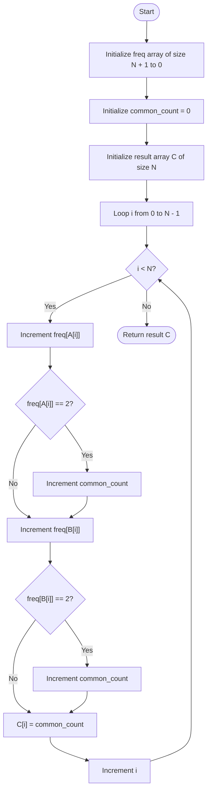

# 💡 Approach — Find the Prefix Common Array of Two Arrays

| 📄 [Problem](./Problem.md) | 💡 [Approach](./Approach.md) | 🧩 [Solution](./Solution.cpp) | 🚀 [Main](./Main.cpp) |
| :------------------------: | :--------------------------: | :---------------------------: | :-------------------: |

# 📊 Metadata

---

> [!TIP]
> **Core Insight:**  
> Since both input arrays `A` and `B` are permutations of size $N$ (containing numbers from $1$ to $N$ exactly once), any number can appear at most once in `A` and at most once in `B`. 
> 
> As we traverse both arrays index by index:
> 1. We keep a frequency counter for all numbers we've seen so far.
> 2. For each index `i`, we see the numbers `A[i]` and `B[i]`. We increment their frequency in our tracker.
> 3. If a number's frequency reaches `2` (meaning we've encountered it once in `A` and once in `B`), it is guaranteed to be a common prefix element. We can increment our running count of common elements.
> 4. We store this running count at index `i` of the result array.

---

## 🔩 Step-by-Step Breakdown

### Step 1: Setup Tracking Variables

- Create a frequency/count tracker array `freq` of size $N + 1$ initialized to $0$.
- Initialize a running counter `common_count = 0` to keep track of common elements.
- Create an output array `C` of size $N$.

### Step 2: Traverse Both Arrays

- Loop through each index `i` from $0$ to $N - 1$.

### Step 3: Update Frequency and Check Common Elements

- For the element `A[i]` from array `A`:
  - Increment its frequency in `freq`.
  - If `freq[A[i]] == 2`, increment `common_count` by $1$.
- For the element `B[i]` from array `B`:
  - Increment its frequency in `freq`.
  - If `freq[B[i]] == 2`, increment `common_count` by $1$.

### Step 4: Populate Result

- Set `C[i] = common_count`.

### Step 5: Return Result

- Return the resulting array `C` after completing the traversal.

---

## 🔄 Mermaid Flowchart

---

## 📊 Complexity Analysis

| Type                 | Complexity       | Rationale                                                                     |
| :------------------- | :--------------- | :---------------------------------------------------------------------------- |
| **Time Complexity**  | $\mathcal{O}(N)$ | We traverse both arrays exactly once. Increment and check operations in the frequency array take $\mathcal{O}(1)$ time. |
| **Space Complexity** | $\mathcal{O}(N)$ | We use an auxiliary frequency array of size $N+1$ to keep track of seen elements. |

---

> *"Programs must be written for people to read, and only incidentally for machines to execute."* — Harold Abelson

---

<h3>Happy Coding! 🚀</h3>

