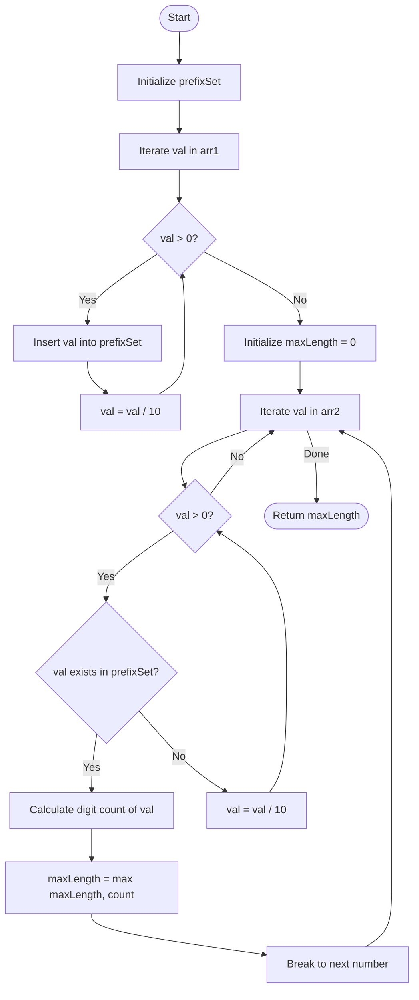

# 💡 Approach — Find the Length of the Longest Common Prefix

| 📄 [Problem](./Problem.md) | 💡 [Approach](./Approach.md) | 🧩 [Solution](./Solution.cpp) | 🚀 [Main](./Main.cpp) |
| :------------------------: | :--------------------------: | :---------------------------: | :-------------------: |

---

> [!TIP]
> **Core Insight:**  
> We need to find the longest common prefix between all pairs $(x, y)$ where $x \in \text{arr1}$ and $y \in \text{arr2}$.
> 
> - A prefix of a positive integer is formed by removing digits from the right side one by one (mathematically, by dividing the number by $10$ repeatedly).
> - Since the maximum value of any integer is $10^8$, each integer has at most $9$ prefixes.
> - We can extract and store **all prefixes of all numbers in `arr1`** in a hash set. 
> - Next, we check each number in `arr2`. By generating its prefixes from the longest to the shortest (starting from the number itself and dividing by $10$ at each step), the **first prefix found in the hash set** is guaranteed to be the longest common prefix for that number. We can then compute its length (number of digits) and update our maximum prefix length.

---

## 🔩 Step-by-Step Breakdown

### Step 1: Prefix Extraction for Array 1

- Initialize a hash set `unordered_set<int> prefixSet`.
- Loop through each number `val` in `arr1`:
  - While `val > 0`, insert `val` into `prefixSet` and update `val = val / 10`.
  - For example, if `val = 123`, the values `123`, `12`, and `1` are all stored in `prefixSet`.

### Step 2: Check and Match with Array 2

- Initialize `maxLength = 0`.
- Loop through each number `val` in `arr2`:
  - While `val > 0`:
    - Check if `val` exists in `prefixSet`.
    - If it does, we have found a common prefix. Since we start with the longest possible representation of `val` and shrink it, the first match is guaranteed to be the longest common prefix for this number.
    - Go to **Step 3** to update the length, and then break the loop to process the next number in `arr2`.
    - Otherwise, update `val = val / 10`.

### Step 3: Longest Match Selection

- Calculate the digit count of the matched prefix using an optimized $O(1)$ helper function to avoid slow `to_string` allocations:
  - If $\text{val} \ge 10^8$, length is $9$.
  - If $\text{val} \ge 10^7$, length is $8$, and so on.
- Update `maxLength = max(maxLength, current_length)`.
- Break out of the inner prefix-matching loop.

### Step 4: Return Result

- Return `maxLength` once all numbers in `arr2` are processed.

---

## 🔄 Mermaid Flowchart

---

## 📊 Complexity Analysis

| Type | Complexity | Description |
| :--- | :--- | :--- |
| **Time Complexity** | $$O((N + M) \log_{10}(\text{max val}))$$ | For each element in both arrays, we perform at most $\log_{10}(\text{max val})$ divisions and set operations. With $\text{max val} \le 10^8$, this is at most $9$ iterations per number. |
| **Auxiliary Space** | $$O(N \log_{10}(\text{max val}))$$ | The hash set stores up to $9 \times N$ unique prefixes from the first array. |

---

> *"Programs must be written for people to read, and only incidentally for machines to execute."* — Harold Abelson

---

<h2>Happy Coding! 🚀</h2>

