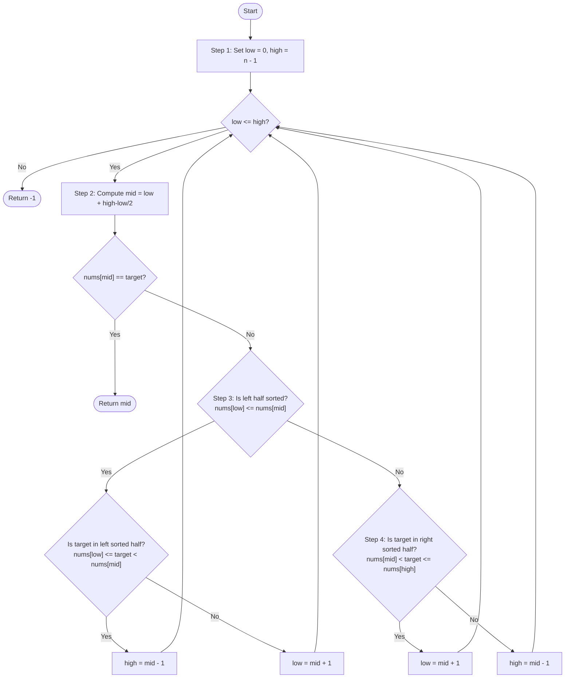

# 💡 Approach — Search in Rotated Sorted Array

| 📄 [Problem](./Problem.md) | 💡 [Approach](./Approach.md) | 🧩 [Solution](./Solution.cpp) | 🚀 [Main](./Main.cpp) |
|:--------------------------:|:-----------------------------:|:------------------------------:|:---------------------:|

---

## 📊 Metadata

---

> [!TIP]
> **Core Insight:**  
> When you divide a rotated sorted array at any index, **at least one of the two halves (left or right) will always be strictly sorted**.
> 
> By comparing the middle element with the boundary elements, we can determine:
> 1. Which half is sorted.
> 2. Whether the target lies within the boundaries of that sorted half.
> 
> This allows us to discard half of the search space at each step, maintaining the $O(\log n)$ logarithmic runtime complexity.

---

## 🔩 Step-by-Step Breakdown

### Step 1: Initialize Search Range
- Define the initial search boundaries: `low = 0` and `high = nums.size() - 1`.

### Step 2: Calculate Midpoint and Check Match
- While `low <= high`, calculate the middle index: `mid = low + (high - low) / 2`.
- If `nums[mid] == target`, immediately return the index `mid`.

### Step 3: Check If Left Half is Sorted
- If `nums[low] <= nums[mid]`, it means the left half `[low ... mid]` is sorted.
  - Determine if the target lies within this sorted range: `nums[low] <= target && target < nums[mid]`.
  - If it does, narrow the search space to the left half by setting `high = mid - 1`.
  - Otherwise, search in the right half by setting `low = mid + 1`.

### Step 4: Check If Right Half is Sorted
- Otherwise, the right half `[mid ... high]` must be sorted.
  - Determine if the target lies within this sorted range: `nums[mid] < target && target <= nums[high]`.
  - If it does, narrow the search space to the right half by setting `low = mid + 1`.
  - Otherwise, search in the left half by setting `high = mid - 1`.

---

## 🔄 Mermaid Flowchart

---

## 📊 Complexity Analysis

| Type | Complexity | Description |
| :--- | :--- | :--- |
| **Time Complexity** | $$O(\log n)$$ | At each step, we determine which half is sorted and cut the search space in half. |
| **Auxiliary Space** | $$O(1)$$ | The search is performed iteratively in-place without additional data structures. |

---

> *"Search not for the path, but make the search your path."* — Unknown

---

<h3>Happy Coding! 🚀</h3>

