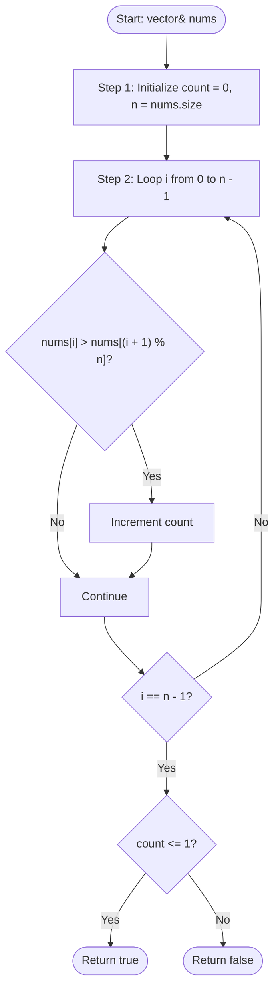

# 💡 Approach — Check if Array Is Sorted and Rotated

| 📄 [Problem](./Problem.md) | 💡 [Approach](./Approach.md) | 🧩 [Solution](./Solution.cpp) | 🚀 [Main](./Main.cpp) |
|:--------------------------:|:-----------------------------:|:------------------------------:|:---------------------:|

---

## 📊 Metadata

---

> [!TIP]
> **Core Insight:**  
> If an array is sorted and rotated (by any positions, including 0), it can have at most one "drop point" or "break point". A break point is defined as an index $i$ where `nums[i] > nums[i+1]`.
> 
> When treating the array circularly (meaning the next element of the last element `nums[n-1]` is the first element `nums[0]`), we check `nums[i] > nums[(i + 1) % n]`:
> - A perfectly sorted array with no rotation will have 0 break points (if all elements are equal) or 1 break point (specifically at the boundary where `nums[n-1] > nums[0]` is evaluated, since `nums[n-1] > nums[0]`).
> - A sorted and rotated array (with a rotation pivot $x > 0$) will have exactly 1 break point (at the pivot where the transition from the largest to the smallest element happens, and `nums[n-1] <= nums[0]` must hold).
> - If there are more than 1 break points, it means the array has multiple descents and thus cannot be represented as a sorted and rotated array.

---

## 🔩 Step-by-Step Breakdown

### Step 1: Initialize Count and Size
- Let `count = 0` keep track of the number of break points.
- Get the size of the array `n = nums.size()`.

### Step 2: Count Circular Break Points
- Iterate through the array from `i = 0` to `n - 1`.
- For each element, compare it to the next circular element: `nums[(i + 1) % n]`.
- If `nums[i] > nums[(i + 1) % n]`, increment `count`.

### Step 3: Verify Rotated Sorted Property
- If the count of break points is less than or equal to $1$, return `true`.
- Otherwise, return `false`.

---

## 🔄 Mermaid Flowchart

---

## 📊 Complexity Analysis

| Type | Complexity | Description |
| :--- | :--- | :--- |
| **Time Complexity** | $O(n)$ | We perform a single pass traversal over the array of size $n$. |
| **Auxiliary Space** | $O(1)$ | No extra space is used; we only use constant memory for counters and size variables. |

---

> *"Simplicity is the ultimate sophistication."* — Leonardo da Vinci

---

<h3>Happy Coding! 🚀</h3>

