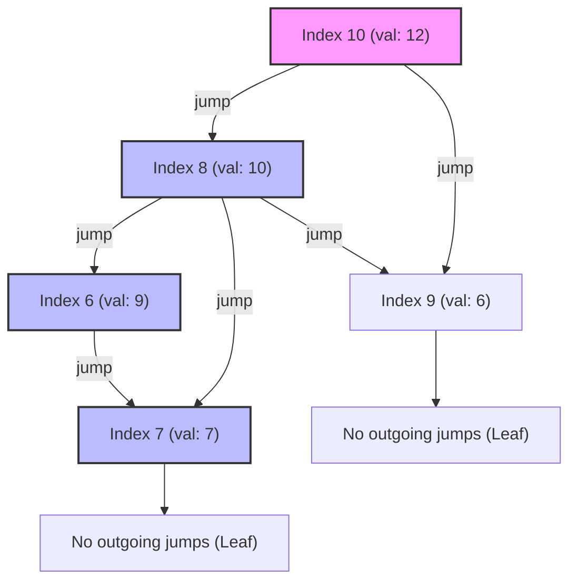
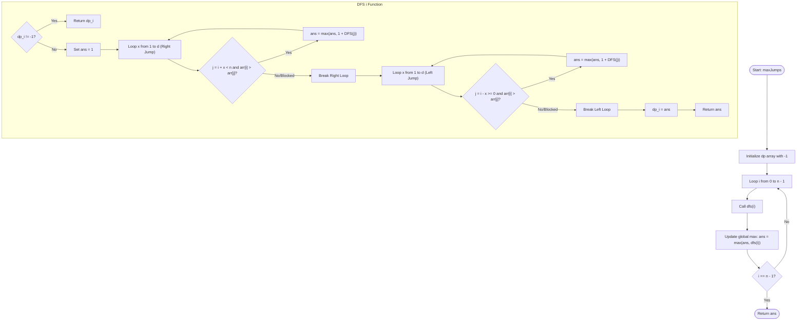

# 💡 Approach — Jump Game V

| 📄 [Problem](./Problem.md) | 💡 [Approach](./Approach.md) | 🧩 [Solution](./Solution.cpp) | 🚀 [Main](./Main.cpp) |
|:--------------------------:|:-----------------------------:|:------------------------------:|:---------------------:|

---

## 📊 Metadata

---

> [!TIP]
> **Core Insight:**  
> Since we can only jump from a higher element to a strictly lower element ($\text{arr}[i] > \text{arr}[j]$), the jump transitions form a **Directed Acyclic Graph (DAG)**. There can be no cycles because each step strictly decreases the height value.
> 
> Therefore, we can find the longest path in this DAG starting from any node using **Depth First Search (DFS) with Memoization (Dynamic Programming)**:
> 1. Let `dp[i]` store the maximum indices we can visit starting from index `i`.
> 2. For each index `i`, we can try jumping to index `j` within a range $d$ to the left and to the right.
> 3. The jump is valid if and only if $\text{arr}[i] > \text{arr}[j]$ and all elements between $i$ and $j$ are strictly smaller than $\text{arr}[i]$ (which means we cannot "jump over" any element that is $\ge \text{arr}[i]$). As soon as we see an element $\ge \text{arr}[i]$, we must stop scanning in that direction.
> 4. The transition is `dp[i] = 1 + max(dp[j])` for all valid destinations `j`.

---

## 🔩 Step-by-Step Breakdown

### Step 1: Initialize DP Cache
- Initialize a `dp` table of size $n$ filled with `-1` to represent unvisited/uncomputed states.

### Step 2: DFS with Memoization (`dfs(i)`)
- If `dp[i]` is already computed (i.e. `dp[i] != -1`), return `dp[i]`.
- Set the default path length starting from `i` as `ans = 1` (just visiting index `i` itself).
- **Scan Right:** Loop `x` from $1$ to $d$:
  - Let target index `j = i + x`.
  - If `j >= n` or `arr[j] >= arr[i]`, break the loop immediately (we cannot jump over or onto this element).
  - Otherwise, update `ans = max(ans, 1 + dfs(j))`.
- **Scan Left:** Loop `x` from $1$ to $d$:
  - Let target index `j = i - x`.
  - If `j < 0` or `arr[j] >= arr[i]`, break the loop immediately.
  - Otherwise, update `ans = max(ans, 1 + dfs(j))`.
- Cache the result: `dp[i] = ans` and return it.

### Step 3: Find Global Maximum
- Iterate through all possible starting indices $i$ from $0$ to $n-1$.
- Find the overall maximum indices visited: $\max_{0 \le i < n} (\text{dfs}(i))$.

---

## 🕸️ Jump Transition DAG (Example 1 Subset)

This directed graph shows a subset of valid transitions for the array `arr = [6, 4, 14, 6, 8, 13, 9, 7, 10, 6, 12]` with $d = 2$. Notice how starting at **Index 10 (value 12)** allows the longest chain of jumps: `10 --> 8 --> 6 --> 7`.

---

## 🔄 Mermaid Flowchart

---

## 📊 Complexity Analysis

| Type | Complexity | Description |
| :--- | :--- | :--- |
| **Time Complexity** | $O(n \cdot d)$ | There are $n$ states in total. For each state `i`, we scan up to $d$ elements to the right and $d$ elements to the left, doing $O(1)$ work for each step. Since each state is computed exactly once, the total time complexity is bounded by $O(n \cdot d)$. |
| **Auxiliary Space** | $O(n)$ | The space is used for the memoization table `dp` of size $n$, plus the recursive system call stack which can go up to depth $n$ in the worst-case. |

---

> *"Sometimes, the longest path is found by taking one careful step at a time."* — Unknown

---

<h3>Happy Coding! 🚀</h3>

