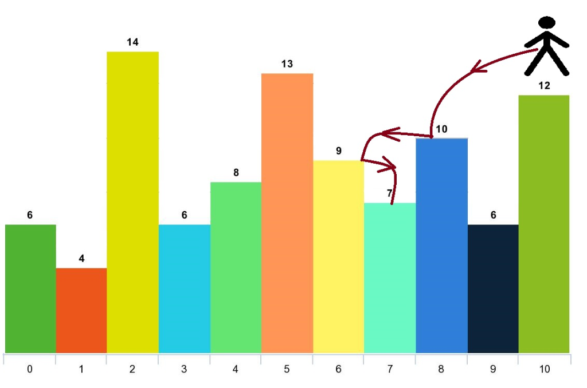

# [1340. Jump Game V](https://leetcode.com/problems/jump-game-v/description/)

| 📄 [Problem](./Problem.md) | 💡 [Approach](./Approach.md) | 🧩 [Solution](./Solution.cpp) | 🚀 [Main](./Main.cpp) |
|:--------------------------:|:-----------------------------:|:------------------------------:|:---------------------:|

---

## 📊 Metadata

---

## 🧩 Problem Description

Given an array of integers `arr` and an integer `d`. In one step you can jump from index `i` to index:

- $i + x$ where: $i + x < \text{arr.length}$ and $0 < x \le d$.
- $i - x$ where: $i - x \ge 0$ and $0 < x \le d$.

In addition, you can only jump from index `i` to index `j` if $\text{arr}[i] > \text{arr}[j]$ and $\text{arr}[i] > \text{arr}[k]$ for all indices $k$ between $i$ and $j$ (More formally $\min(i, j) < k < \max(i, j)$).

You can choose any index of the array and start jumping. Return the maximum number of indices you can visit.

Notice that you cannot jump outside of the array at any time.

---

## 📌 Examples

### Example 1

  

**Input:** `arr = [6,4,14,6,8,13,9,7,10,6,12]`, `d = 2`  
**Output:** `4`  
**Explanation:** You can start at index 10. You can jump `10 --> 8 --> 6 --> 7` as shown:
- Start at index 10 ($\text{arr}[10] = 12$).
- Jump to index 8 ($\text{arr}[8] = 10$).
- Jump to index 6 ($\text{arr}[6] = 9$).
- Jump to index 7 ($\text{arr}[7] = 7$).
- From index 7, no more valid jumps can be made.
Total visited indices = 4.

### Example 2

**Input:** `arr = [3,3,3,3,3]`, `d = 3`  
**Output:** `1`  
**Explanation:** You can start at any index. You can never jump to any other index because they all have the same value ($\text{arr}[i] \ngtr \text{arr}[j]$).

### Example 3

**Input:** `arr = [7,6,5,4,3,2,1]`, `d = 1`  
**Output:** `7`  
**Explanation:** Start at index 0. You can visit all indices in order `0 --> 1 --> 2 --> 3 --> 4 --> 5 --> 6`.

---

## 📐 Constraints

- $1 \le \text{arr.length} \le 1000$
- $1 \le \text{arr}[i] \le 10^5$
- $1 \le d \le \text{arr.length}$

---

## ⏱️ Expected Complexities

| Complexity | Requirement |
| :--- | :--- |
| **Time Complexity** | $O(n \cdot d)$ |
| **Auxiliary Space** | $O(n)$ |

---

## 🏷️ Topic Tags

- `Array`
- `Dynamic Programming`
- `Memoization`
- `Algorithms`

---

<h3>Happy Coding! 🚀</h3>

