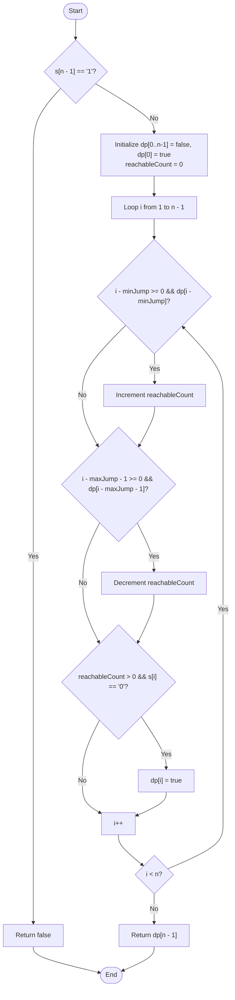

# 💡 Approach — Jump Game VII

| 📄 [Problem](./Problem.md) | 💡 [Approach](./Approach.md) | 🧩 [Solution](./Solution.cpp) | 🚀 [Main](./Main.cpp) |
|:--------------------------:|:-----------------------------:|:------------------------------:|:---------------------:|

---

## 📊 Metadata

---

---

> [!TIP]
> **Core Insight:**  
> A naive Dynamic Programming approach checks all previous indices $j$ from $i - \text{maxJump}$ to $i - \text{minJump}$ for each index $i$. This yields an $O(n \cdot (\text{maxJump} - \text{minJump}))$ time complexity, which is $O(n^2)$ in the worst case.
> 
> We can optimize this to $O(n)$ by keeping track of the number of reachable indices within our active jump window $[i - \text{maxJump}, i - \text{minJump}]$ using a **Sliding Window / Queue-like count**:
> 1. Maintain a count of reachable indices (`reachableCount`) in the current window.
> 2. As the index $i$ advances, we slide the window:
>    - The index $i - \text{minJump}$ enters the window. If it is reachable, increment `reachableCount`.
>    - The index $i - \text{maxJump} - 1$ exits the window. If it is reachable, decrement `reachableCount`.
> 3. If `reachableCount > 0` and the current character is `'0'`, the current index $i$ is reachable.

---

## 🔩 Step-by-Step Breakdown

### Step 1: Initialize DP Array
- If the destination index $n - 1$ contains `'1'`, return `false` immediately because it is impossible to reach.
- Initialize a boolean `dp` array of size $n$ with `false`, and set `dp[0] = true` since we start at index $0$.

### Step 2: Traverse using a Sliding Window
- Maintain an integer `reachableCount = 0`.
- Iterate through each index $i$ from $1$ to $n-1$:
  - If $i - \text{minJump} \ge 0$ and `dp[i - minJump]` is `true`, increment `reachableCount` (an index capable of jumping to $i$ has entered the window).
  - If $i - \text{maxJump} - 1 \ge 0$ and `dp[i - maxJump - 1]` is `true`, decrement `reachableCount` (that index has slid out of range).

### Step 3: Check Reachability
- If `reachableCount > 0` and `s[i] == '0'`, then the current index $i$ is reachable. Set `dp[i] = true`.

### Step 4: Return Destination State
- After iterating through the string, the answer is whether the last index is reachable. Return `dp[n - 1]`.

---

## 🔄 Mermaid Flowchart

---

## 📊 Complexity Analysis

| Type | Complexity | Description |
| :--- | :--- | :--- |
| **Time Complexity** | $O(n)$ | We iterate through the string of length $n$ exactly once. In each iteration, we perform constant-time additions and subtractions to update `reachableCount`, leading to a strictly linear time complexity. |
| **Auxiliary Space** | $O(n)$ | We use a boolean vector of size $n$ to store the reachability states. |

---

> *"The journey of a thousand miles begins with one step, but we must make sure that step is within our reach."* — **Lao Tzu**

---

<h3>Happy Coding! 🚀</h3>

