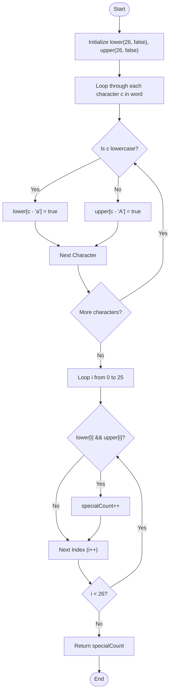

# 💡 Approach — Count the Number of Special Characters I

| 📄 [Problem](./Problem.md) | 💡 [Approach](./Approach.md) | 🧩 [Solution](./Solution.cpp) | 🚀 [Main](./Main.cpp) |
|:--------------------------:|:-----------------------------:|:------------------------------:|:---------------------:|

---

---

> [!TIP]
> **Core Insight:**  
> To determine if a letter is "special", we need to check if it appears both in its lowercase and uppercase form within the string.
> 
> Since there are only 26 English alphabetic characters, we can maintain two lookup frequency tables (or boolean flags):
> 1. One table tracks which lowercase letters (`'a'` to `'z'`) have been seen.
> 2. The other table tracks which uppercase letters (`'A'` to `'Z'`) have been seen.
> 
> After scanning the entire string, we simply count the alphabet positions that have `true` marked in both lookup tables. This results in $O(n)$ time complexity and a constant $O(1)$ auxiliary space complexity.

---

## 🔩 Step-by-Step Breakdown

### Step 1: Initialize Frequency or Presence Trackers
- Declare two boolean arrays/vectors `lower` and `upper` of size 26, initialized to `false`. These arrays correspond to letters `'a'` through `'z'` and `'A'` through `'Z'` respectively.

### Step 2: Mark Character Presence
- Iterate through each character `c` in the string `word`:
  - If `c` is a lowercase letter (i.e. `c >= 'a' && c <= 'z'`), set `lower[c - 'a'] = true`.
  - If `c` is an uppercase letter (i.e. `c >= 'A' && c <= 'Z'`), set `upper[c - 'A'] = true`.

### Step 3: Count and Return Special Characters
- Initialize a counter `specialCount = 0`.
- Loop through index `i` from `0` to `25` (corresponding to alphabet letters A-Z):
  - If both `lower[i]` and `upper[i]` are `true`, increment `specialCount`.
- Return the final value of `specialCount`.

---

## 🔄 Mermaid Flowchart

---

## 📊 Complexity Analysis

| Type | Complexity | Description |
| :--- | :--- | :--- |
| **Time Complexity** | $O(n)$ | We iterate through the string of length $n$ once, performing constant $O(1)$ lookup operations. After that, we perform a fixed loop of $26$ iterations. |
| **Auxiliary Space** | $O(1)$ | We use two boolean vectors of size 26, which consume a constant amount of memory independent of the input size. |

---

> *"The details are not the details. They make the design."* — **Charles Eames**

---

<h3>Happy Coding! 🚀</h3>

