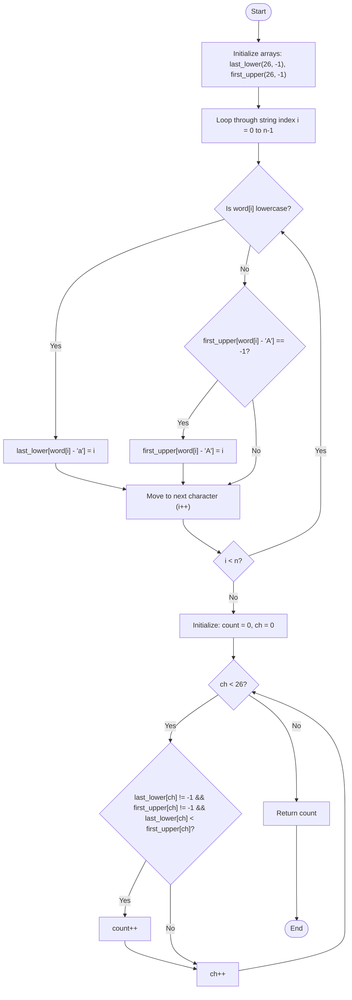

# 💡 Approach — Count the Number of Special Characters II

| 📄 [Problem](./Problem.md) | 💡 [Approach](./Approach.md) | 🧩 [Solution](./Solution.cpp) | 🚀 [Main](./Main.cpp) |
|:--------------------------:|:-----------------------------:|:------------------------------:|:---------------------:|

---

## 📊 Metadata

---

> [!TIP]
> **Core Insight:**  
> To determine if all lowercase occurrences of a character appear before its first uppercase occurrence, we only need to compare two key indices for that character:
> 1. The **last** index at which the lowercase version of the letter appears (`last_lower`).
> 2. The **first** index at which the uppercase version of the letter appears (`first_upper`).
>
> If the last lowercase occurrence is positioned before the first uppercase occurrence (i.e., `last_lower < first_upper`), it mathematically guarantees that *every* lowercase occurrence of that letter appears before the first uppercase occurrence of that letter.
>
> Since there are only 26 English letters, we can store these indices in two fixed-size arrays of size 26. This allows us to achieve $O(n)$ time complexity and $O(1)$ auxiliary space.

---

## 🔩 Step-by-Step Breakdown

### Step 1: Initialize Trackers
- Allocate two integer arrays, `last_lower` and `first_upper`, each of size 26 initialized to `-1`. These will store the indices of the respective occurrences of each character.

### Step 2: Traverse the String
- Iterate through each character `word[i]` at index `i` of the string `word`:
  - If `word[i]` is lowercase (`'a'` to `'z'`), update the last seen index:
    $$\text{last\_lower}[\text{word}[i] - \text{'a'}] = i$$
  - If `word[i]` is uppercase (`'A'` to `'Z'`), record its first occurrence:
    - Only update if the index is unset (i.e., equal to `-1`):
      $$\text{first\_upper}[\text{word}[i] - \text{'A'}] = i$$

### Step 3: Count Special Characters
- Initialize a `count = 0`.
- Loop through the 26 characters (0 to 25):
  - Check if the character has appeared in both cases:
    $$\text{last\_lower}[i] \neq -1 \quad \text{and} \quad \text{first\_upper}[i] \neq -1$$
  - Check if the last lowercase occurrence is before the first uppercase occurrence:
    $$\text{last\_lower}[i] < \text{first\_upper}[i]$$
  - If both conditions are satisfied, increment `count`.
- Return the final `count`.

---

## 🔄 Mermaid Flowchart

---

## 📊 Complexity Analysis

| Type | Complexity | Description |
| :--- | :--- | :--- |
| **Time Complexity** | $O(n)$ | We scan the string of length $n$ exactly once, followed by a constant iteration loop of size 26. |
| **Auxiliary Space** | $O(1)$ | We use two arrays of fixed size 26 to store tracking indices, which consumes constant memory. |

---

> *"The essence of efficient string processing is to distill sequential records into static properties of the alphabet."* — **Anonymous**

---

<h3>Happy Coding! 🚀</h3>

