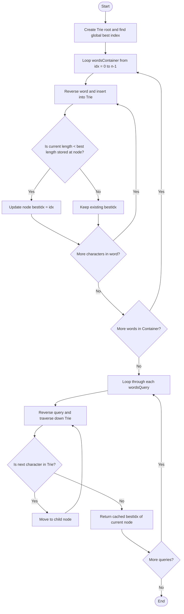

# 💡 Approach — Longest Common Suffix Queries

| 📄 [Problem](./Problem.md) | 💡 [Approach](./Approach.md) | 🧩 [Solution](./Solution.cpp) | 🚀 [Main](./Main.cpp) |
|:--------------------------:|:-----------------------------:|:------------------------------:|:---------------------:|

---

## 📊 Metadata

---

> [!TIP]
> **Core Insight:**  
> Suffix matching on strings can be framed as prefix matching by reversing the strings. 
> By reversing all words in `wordsContainer` and inserting them into a Trie, the longest common suffix of a query matches the longest common prefix of the reversed query in the Trie.
> 
> To handle tie-breaking optimally, each node in the Trie can cache the index of the "best" word (`best_index`) that passes through it. The criteria for the best word are:
> 1. Smallest string length.
> 2. Earliest index in `wordsContainer` in case of length ties.
> 
> During construction, we iterate `wordsContainer` from left to right (indices $0 \dots n-1$). At each node visited during insertion of a word at index `idx` of length `len`:
> - If `len < wordsContainer[best_index].length()`, we update the cached `best_index = idx`.
> - Because we insert from left to right, a tie in length naturally preserves the smaller index (earliest occurrence), so we only update on strictly smaller lengths.
> 
> To answer a query:
> - Reverse the query and traverse down the Trie.
> - Follow character links. If a mismatch occurs, stop immediately.
> - The answer is the `best_index` cached at the last successfully visited node. If even the first character fails to match, we stop at the root node, which correctly yields the globally best index in `wordsContainer`.

---

## 🔩 Step-by-Step Breakdown

### Step 1: Initialize State Variables
- Define the `TrieNode` structure. Each node has a pointer array of size 26 for children and an integer `best_index` tracking the best matching index.
- Create the root node of the Trie.
- Iterate through `wordsContainer` to find the global best index (shortest length, then smallest index) and initialize the root node's `best_index` with it.

### Step 2: Traverse and Build the Trie
- Loop through each word in `wordsContainer` from index `0` to `n - 1`.
- For each word, traverse the Trie from the last character to the first (reverse order).
- At each node (including the root and newly created children), update `best_index` if the current word has a strictly smaller length than the word previously associated with the node's cached index.

### Step 3: Collect and Return Results
- Initialize a result vector `ans` of size equal to `wordsQuery.length`.
- For each query, traverse down the Trie from the last character to the first.
- Stop when a character link is missing or the query is fully processed.
- Save the `best_index` of the last successfully visited node to `ans[i]`.
- Return `ans`.

---

## 🔄 Mermaid Flowchart

---

## 📊 Complexity Analysis

| Type | Complexity | Description |
| :--- | :--- | :--- |
| **Time Complexity** | $O(\sum |W_{\text{container}}| + \sum |W_{\text{query}}|)$ | Inserting a word of length $L$ takes $O(L)$ character lookups. Similarly, querying a word of length $M$ takes $O(M)$ lookups. The overall time is linear with respect to the total sum of lengths of all strings in both arrays. |
| **Auxiliary Space** | $O(\sum |W_{\text{container}}| \cdot 26)$ | In the worst case, every character of the words in the container generates a new Trie node. Each node occupies $O(26)$ space for pointer storage. |

---

> *"Looking at things in reverse often simplifies the search for our roots."* — **Anonymous**

---

<h3>Happy Coding! 🚀</h3>

