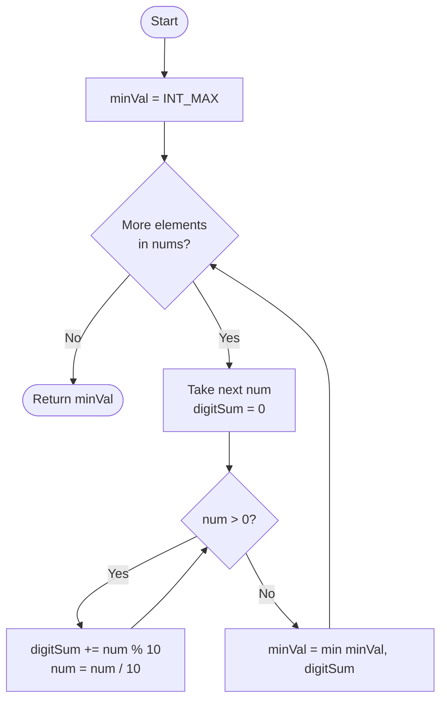

# 💡 Approach — Minimum Element After Replacement With Digit Sum

| 📄 [Problem](./Problem.md) | 💡 [Approach](./Approach.md) | 🧩 [Solution](./Solution.cpp) | 🚀 [Main](./Main.cpp) |
|:--------------------------:|:-----------------------------:|:------------------------------:|:---------------------:|

---

## 📊 Metadata

---

## 🧠 Core Insight

> [!TIP]
> Replacing a number with its digit sum always produces a value **≤ the original number** (for positive integers). So we simply iterate through the array, compute each element's digit sum using repeated modulo + division, and track the running minimum — all in a single pass with **O(1)** extra space.

---

## 🔩 Step-by-Step Breakdown

**Step 1 — Initialise the answer**
- Set `minVal = INT_MAX` as the starting minimum.

**Step 2 — Iterate over every element**
- For each `num` in `nums`, compute its digit sum.

**Step 3 — Compute digit sum**
- While `num > 0`: extract the last digit with `num % 10`, add it to `digitSum`, then strip the digit with `num /= 10`.

**Step 4 — Update running minimum**
- After computing `digitSum`, update `minVal = min(minVal, digitSum)`.

**Step 5 — Return result**
- After the loop, `minVal` holds the smallest digit sum across all elements.

---

## 🔄 Mermaid Flowchart

---

## 📊 Complexity Analysis

| Dimension | Complexity | Reasoning |
|:---------:|:----------:|:----------|
| 🕒 Time   | $O(n \cdot d)$ | $n$ elements × $d$ digits each (max $d = 5$ for $\leq 10^4$) → effectively $O(n)$ |
| 🗃️ Space  | $O(1)$     | Only two scalar variables used |

---

## 🔍 Dry Run — `nums = [999, 19, 199]`

| num | Digit Extraction | digitSum | minVal |
|:---:|:----------------:|:--------:|:------:|
| 999 | 9+9+9 | 27 | 27 |
| 19  | 1+9   | 10 | 10 |
| 199 | 1+9+9 | 19 | 10 |

Final answer: **10** ✅

---

> *"Simplicity is the soul of efficiency."*
> — **Austin Freeman**

---

<h3>Happy Coding! 🚀</h3>

