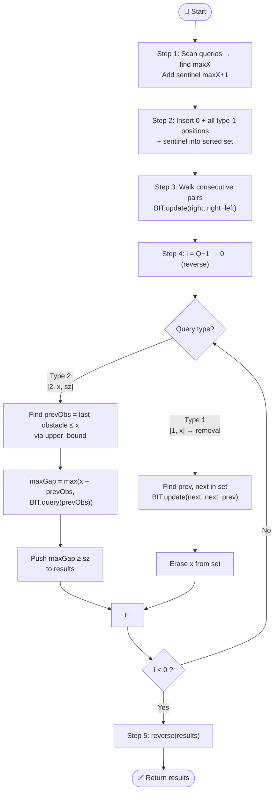

# 💡 Approach — Block Placement Queries

| 📄 [Problem](./Problem.md) | 💡 [Approach](./Approach.md) | 🧩 [Solution](./Solution.cpp) | 🚀 [Main](./Main.cpp) |
|:--------------------------:|:-----------------------------:|:------------------------------:|:---------------------:|

---

## 📊 Metadata

---

## 🧠 Core Insight

> [!TIP]
> **The key observation:** A block of size `sz` fits in `[0, x]` if and only if the **maximum gap** between any two consecutive obstacles within `[0, x]` (including the origin `0` as a virtual obstacle, and capping the rightmost gap at `x`) is ≥ `sz`.
>
> **The clever trick:** Process queries **offline in reverse**. When reversed, type-1 queries become **obstacle removals** — meaning gaps can only **grow**. A BIT (Fenwick Tree) for **prefix maximum** only supports monotone increases, so this reversal makes it perfectly applicable.
>
> Store each gap at its **right endpoint**. To answer a type-2 query at `x`, take `max(x − prevObs, BIT.prefixMax(prevObs))` where `prevObs` is the last obstacle ≤ `x`.

---

## 🔩 Step-by-Step Breakdown

**Step 1 — Scan for maximum coordinate.**
Iterate over all queries to find `maxX` — the largest coordinate. This sizes the BIT and sentinel.

**Step 2 — Collect all type-1 positions.**
Pre-insert `0` (origin) and `maxX + 1` (right sentinel) alongside all type-1 obstacle positions into a sorted `set<int>`. This gives the initial obstacle configuration (all obstacles pre-placed since we process in reverse).

**Step 3 — Initialise BIT with all initial gaps.**
Walk consecutive pairs in the set; for each pair `(left, right)`, call `BIT.update(right, right − left)`. The BIT stores the gap with its **right endpoint** as the key.

**Step 4 — Process queries in reverse.**
- **Type 2 `[2, x, sz]`:** Find `prevObs` = last obstacle ≤ `x` via `upper_bound`. Compute `maxGap = max(x − prevObs, BIT.query(prevObs))`. Push `maxGap ≥ sz` to results.
- **Type 1 `[1, x]`** (treated as removal): Locate `x` in the set; find its `prev` and `next` neighbours. Call `BIT.update(next, next − prev)` — this widens the merged gap and always **increases** the BIT value (safe). Erase `x` from the set.

**Step 5 — Reverse results and return.**
Since queries were processed right-to-left, reverse the collected boolean answers.

---

## 🔄 Mermaid Flowchart

---

## 🔍 Dry Run — Example 2

`queries = [[1,7],[2,7,6],[1,2],[2,7,5],[2,7,6]]`  
Initial set: `{0, 2, 7, 8}` · BIT: `update(2,2), update(7,5), update(8,1)`

| i | Query | Action | prevObs | maxGap | Result |
|:-:|:-----:|:------:|:-------:|:------:|:------:|
| 4 | `[2,7,6]` | query x=7,sz=6 | 7 | max(0, BIT(7)=5)=5 | 5≥6? ❌ false |
| 3 | `[2,7,5]` | query x=7,sz=5 | 7 | max(0, 5)=5 | 5≥5? ✅ true |
| 2 | `[1,2]`   | remove 2; update(7, 7−0=7) | — | — | — |
| 1 | `[2,7,6]` | query x=7,sz=6 | 7 | max(0, BIT(7)=7)=7 | 7≥6? ✅ true |
| 0 | `[1,7]`   | remove 7; update(8, 8−0=8) | — | — | — |

Results collected (reverse): `[false, true, true]` → reversed → **`[true, true, false]`** ✅

---

## 💡 Why Stale BIT Values Are Safe

When obstacle `x` (between `prev` and `next`) is removed:
- BIT at `x` retains the old (stale) value `x − prev`.
- BIT at `next` is updated to the new (larger) value `next − prev`.
- Any future query on `BIT.query(pos)` where `pos ≥ next` sees both values; since `x − prev < next − prev`, **the stale value is always dominated**. ✅

---

## 📊 Complexity Analysis

| Complexity Type  | Value           | Reasoning |
|:----------------:|:---------------:|:---------:|
| **Time**         | `O(Q log M)`    | Each query does one `set` operation (O(log Q)) and one BIT operation (O(log M)) |
| **Auxiliary Space** | `O(Q + M)`   | Sorted set holds ≤ Q+2 elements; BIT of size M |

> `Q` = number of queries ≤ 1.5×10⁴, `M` = max coordinate ≤ 5×10⁴

---

> *"Simplicity is prerequisite for reliability."*
> — **Edsger W. Dijkstra**

---

<h3>Happy Coding! 🚀</h3>

