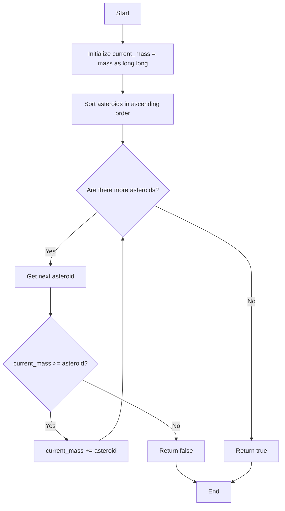

# 💡 Approach — Destroying Asteroids

| 📄 [Problem](./Problem.md) | 💡 [Approach](./Approach.md) | 🧩 [Solution](./Solution.cpp) | 🚀 [Main](./Main.cpp) |
|:--------------------------:|:-----------------------------:|:------------------------------:|:---------------------:|

## 📊 Metadata

-blue?style=for-the-badge)
-blue?style=for-the-badge)

> [!TIP]
> **Core Insight:** To maximize the mass we can accumulate and ensure the destruction of all asteroids, we should always target the smallest available asteroids first. This greedy choice guarantees that if there's any valid order to destroy all asteroids, the sorted order will be one of them.

## 🔩 Step-by-Step Breakdown
1. **Initialize Variables:** Convert the initial `mass` to a `long long` integer. This is crucial because the sum of asteroid masses can easily exceed the maximum limit of a standard 32-bit integer, leading to overflow issues.
2. **Sort the Asteroids:** Sort the given `asteroids` array in ascending order.
3. **Simulate Collisions:** Iterate through the sorted `asteroids` array. 
   - If the current `mass` is greater than or equal to the current asteroid's mass, the planet destroys it, and we add its mass to our current `mass`.
   - If our current `mass` is strictly less than the asteroid's mass, we can't destroy it (nor any subsequent larger asteroids), so we return `false`.
4. **Return Result:** If the loop completes successfully, it means all asteroids were destroyed, so we return `true`.

## 🔄 Mermaid Flowchart

## 📊 Complexity Analysis

| Complexity | Analysis |
|:---|:---|
| **Time** | $\mathcal{O}(N \log N)$ — Sorting the array dominates the time complexity. The subsequent iteration takes $\mathcal{O}(N)$ time. |
| **Space** | $\mathcal{O}(1)$ or $\mathcal{O}(\log N)$ — Depending on the sorting algorithm used under the hood (e.g., IntroSort generally uses $\mathcal{O}(\log N)$ auxiliary stack space). No extra data structures are created. |

> *"First, solve the problem. Then, write the code."*

---

<h3>Happy Coding! 🚀</h3>

