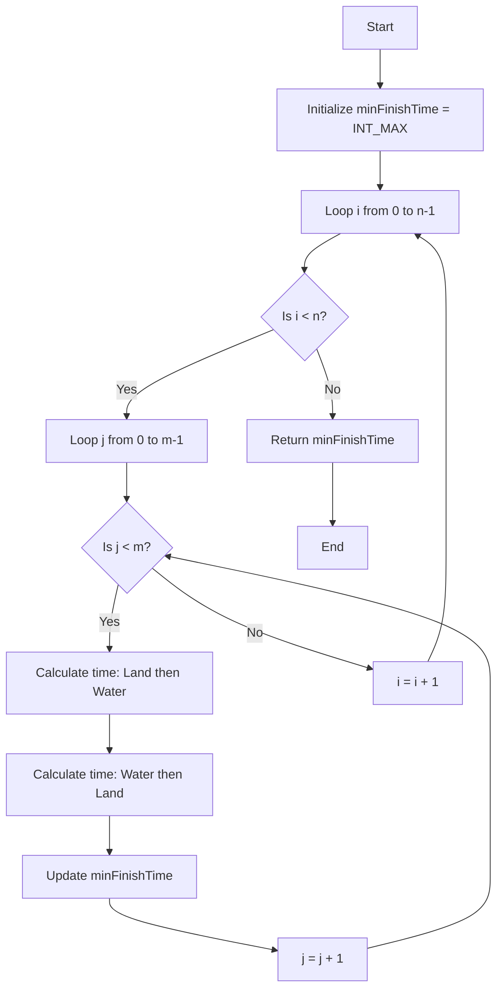

# 💡 Approach — Earliest Finish Time for Land and Water Rides I

| 📄 [Problem](./Problem.md) | 💡 [Approach](./Approach.md) | 🧩 [Solution](./Solution.cpp) | 🚀 [Main](./Main.cpp) |
|:--------------------------:|:-----------------------------:|:------------------------------:|:---------------------:|

## 📊 Metadata

> [!TIP]
> **Core Insight**
> Since the number of rides is small ($$n, m \leq 100$$), we can simply simulate taking every possible pair of land and water rides. For each pair, we evaluate two orderings: doing the land ride first, and doing the water ride first. We keep track of the minimum possible finish time across all combinations.

## 🔩 Step-by-Step Breakdown

1. **Initialize Minimum Finish Time:** Set `minFinishTime` to a very large value (e.g., `INT_MAX`) to track the best overall time.
2. **Iterate Land Rides:** Loop through each land ride using an index `i`.
3. **Iterate Water Rides:** Loop through each water ride using an index `j`.
4. **Calculate Land First Ordering:** For a chosen pair, if we take the land ride first, it finishes at `landStartTime[i] + landDuration[i]`. We can start the water ride at the maximum of this finish time and `waterStartTime[j]`. The total finish time is this start time plus `waterDuration[j]`.
5. **Calculate Water First Ordering:** If we take the water ride first, it finishes at `waterStartTime[j] + waterDuration[j]`. We can then start the land ride at the maximum of this finish time and `landStartTime[i]`. The total finish time is this start time plus `landDuration[i]`.
6. **Update Minimum:** Take the minimum of the two orderings, and use it to update our global `minFinishTime` if it's smaller.
7. **Return Result:** After iterating through all possible $n \times m$ pairs, return the absolute minimum finish time found.

## 🔄 Mermaid Flowchart

## 📊 Complexity Analysis

| Complexity | Evaluation | Description |
|:---|:---|:---|
| **Time Complexity** | $$O(n \cdot m)$$ | There are $$n$$ land rides and $$m$$ water rides. Using two nested loops, we evaluate each of the $$n \times m$$ pairs exactly once. Evaluating the math for a pair takes $$O(1)$$ time. |
| **Space Complexity** | $$O(1)$$ | We only use a few constant extra integer variables to store start times, durations, and the running minimum. No extra data structures are required. |

> *"First, solve the problem. Then, write the code."*

---

<h3>Happy Coding! 🚀</h3>

