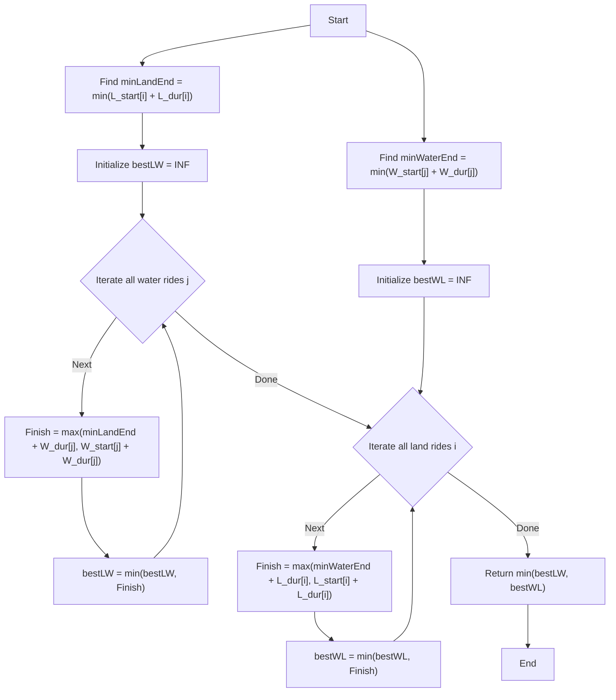

# 💡 Approach — Earliest Finish Time for Land and Water Rides II

| 📄 [Problem](./Problem.md) | 💡 [Approach](./Approach.md) | 🧩 [Solution](./Solution.cpp) | 🚀 [Main](./Main.cpp) |
|:--------------------------:|:-----------------------------:|:------------------------------:|:---------------------:|

## 📊 Metadata

> [!TIP]
> **Core Insight:** The finish time if we do a Land ride $i$ followed by a Water ride $j$ can be simplified to $\max(L_{end}[i] + W_{duration}[j], W_{end}[j])$. Notice that for a fixed water ride $j$, this expression strictly increases as $L_{end}[i]$ increases. Thus, we should unconditionally pick the land ride $i$ that has the **minimum** $L_{end}[i]$ to minimize this sequence! The same logic symmetrically applies to Water-then-Land.

## 🔩 Step-by-Step Breakdown

1. **Find Minimum Land End Time**: Iterate through all land rides and find the minimum possible end time: `minLandEnd = min(landStartTime[i] + landDuration[i])`.
2. **Find Minimum Water End Time**: Similarly, iterate through all water rides and find the minimum possible end time: `minWaterEnd = min(waterStartTime[j] + waterDuration[j])`.
3. **Evaluate Land-then-Water Strategy**: Now that we know the absolute best first land ride to take, we can evaluate pairing it with every possible water ride. The finish time for a specific water ride `j` would be `max(minLandEnd + waterDuration[j], waterStartTime[j] + waterDuration[j])`. Keep track of the minimum overall finish time `bestLW`.
4. **Evaluate Water-then-Land Strategy**: Symmetrically, evaluate the pairing of the absolute best first water ride with every possible land ride. The finish time for a specific land ride `i` would be `max(minWaterEnd + landDuration[i], landStartTime[i] + landDuration[i])`. Keep track of the minimum overall finish time `bestWL`.
5. **Return Optimal Strategy**: Return the minimum of `bestLW` and `bestWL`.

## 🔄 Mermaid Flowchart

## 📊 Complexity Analysis

| Complexity | Analysis |
|:---:|:---|
| **Time** | $\mathcal{O}(N + M)$ where $N$ is the number of land rides and $M$ is the number of water rides. We only iterate through the arrays a constant number of times (finding minimums and evaluating pairings). |
| **Space** | $\mathcal{O}(1)$ since we are only maintaining a few integer variables (`minLandEnd`, `minWaterEnd`, `bestLW`, `bestWL`) regardless of the input size. |

> *"Simplicity is the soul of efficiency."*

---

<h3>Happy Coding! 🚀</h3>

