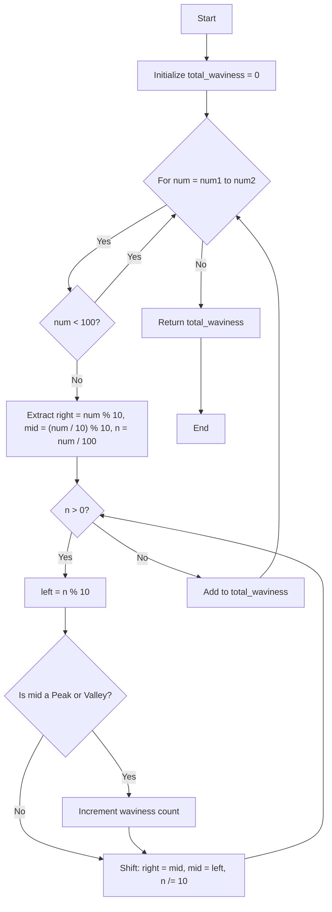

# 💡 Approach — Total Waviness of Numbers in Range I

| 📄 [Problem](./Problem.md) | 💡 [Approach](./Approach.md) | 🧩 [Solution](./Solution.cpp) | 🚀 [Main](./Main.cpp) |
|:--------------------------:|:-----------------------------:|:------------------------------:|:---------------------:|

## 📊 Metadata

> [!TIP]
> **Core Insight:** Given the constraint range is very small ($10^5$), we can solve this problem by directly enumerating all numbers from `num1` to `num2` and calculating the waviness for each. Instead of converting numbers to strings (which has an overhead), extracting digits mathematically using modulo `% 10` and division `/ 10` operators is much faster and more space-efficient.

## 🔩 Step-by-Step Breakdown
1. **Iterate Through the Range**: Use a loop to go through each number from `num1` to `num2`.
2. **Handle Small Numbers**: If the number is less than 100, its waviness is strictly `0`, so we can skip checking its digits.
3. **Digit Extraction Initialization**: Extract the rightmost digit (`right = n % 10`) and the second rightmost digit (`mid = (n / 10) % 10`).
4. **Shift and Compare**: In a loop, continue extracting the next digit to the left (`left = n % 10`).
5. **Peak and Valley Check**: 
   - Check if `mid > left` AND `mid > right` (Peak).
   - Check if `mid < left` AND `mid < right` (Valley).
   - If either condition is true, increment the local waviness count.
6. **Shift Pointers**: Shift the variables leftwards: `right = mid` and `mid = left`, then divide the number by 10 to continue the process.
7. **Accumulate**: Add the waviness of each number to the total sum and return it.

## 🔄 Mermaid Flowchart

## 📊 Complexity Analysis

| Complexity | Details |
|:----------:|:--------|
| **Time** | $\mathcal{O}((N_2 - N_1) \cdot \log_{10}(N_2))$ — For each number in the range, we process its digits. Max range size is $10^5$ and maximum digits per number is 6, requiring well under $10^6$ operations overall. |
| **Space** | $\mathcal{O}(1)$ — Only a few primitive integer variables are utilized, ensuring constant auxiliary space. |

> *"First, solve the problem. Then, write the code."*
> — John Johnson

---

<h3>Happy Coding! 🚀</h3>

