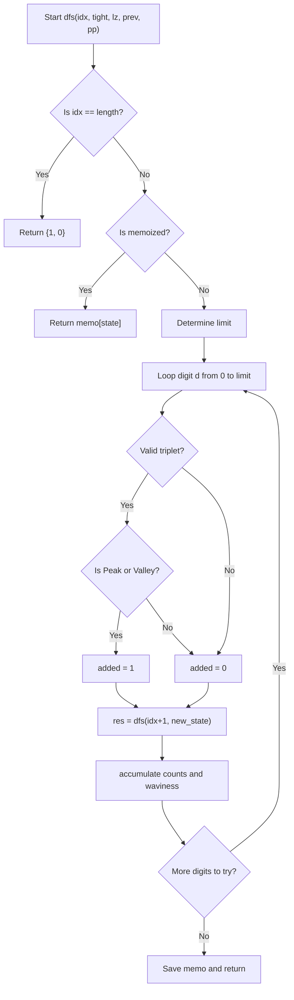

# 💡 Approach — Total Waviness of Numbers in Range II

| 📄 [Problem](./Problem.md) | 💡 [Approach](./Approach.md) | 🧩 [Solution](./Solution.cpp) | 🚀 [Main](./Main.cpp) |
|:--------------------------:|:-----------------------------:|:------------------------------:|:---------------------:|

## 📊 Metadata

> [!TIP]
> **Core Insight:**  
> This problem can be elegantly solved using **Digit DP**. Instead of evaluating each number individually (which is too slow for $10^{15}$), we can dynamically count the waviness by building the number digit by digit. For a given state, we track the current digit and its two previous predecessors to determine if a "peak" or "valley" condition has been satisfied.

## 🔩 Step-by-Step Breakdown

1.  **Digit DP Framework**:
    - We use the function `solve(num)` to compute the total waviness for all numbers in the range `[1, num]`.
    - Our answer will then be `solve(num2) - solve(num1 - 1)`.
2.  **State Definition**:
    - `idx`: The current index in the string representation of our upper bound limit.
    - `tight`: A boolean indicating if we are bounded by the digits of the upper limit string.
    - `leading_zero`: A boolean flag checking if we're still padding zeros at the start of our constructed number.
    - `prev`: The digit chosen immediately prior.
    - `prev_prev`: The digit chosen two steps prior.
3.  **Recursive Subproblem (Waviness Calculation)**:
    - At each step, iterate through all valid digits `d` (from `0` to `limit`).
    - Using `prev` and `prev_prev`, determine if the newly formed triplet constitutes a peak or a valley.
    - A **peak** occurs if `prev_prev < prev > d` and a **valley** occurs if `prev_prev > prev < d`.
    - Crucially, we ignore `leading_zero`s since they do not contribute to peaks or valleys.
4.  **Combinatorial Accumulation**:
    - Instead of just returning waviness, the recursive function returns a `pair`: the total count of valid numbers formed down that recursive path, and their aggregated waviness sum.
    - `Total Waviness = child_waviness + (added_waviness * child_count)`.
5.  **Memoization Check**:
    - Since many states overlap, we store the computed `pair` results in a 5D array cache initialized for each call of `solve()` to trim our complexity heavily.

## 🔄 Mermaid Flowchart

## 📊 Complexity Analysis

| Measure | Complexity | Explanation |
|:---:|:---:|:---|
| **Time Complexity** | $$O(\log_{10}(\text{num2}))$$ | There are $\approx 16 \times 2 \times 2 \times 11 \times 11$ possible states. Evaluating each state takes $O(10)$ time, leading to near instant execution. |
| **Space Complexity** | $$O(\log_{10}(\text{num2}))$$ | The depth of the recursive call stack is capped at $16$, and the DP table memory usage is $O(1)$ relatively (constant dimensions). |

> *"First, solve the problem. Then, write the code."* — John Johnson

---

<h3>Happy Coding! 🚀</h3>

