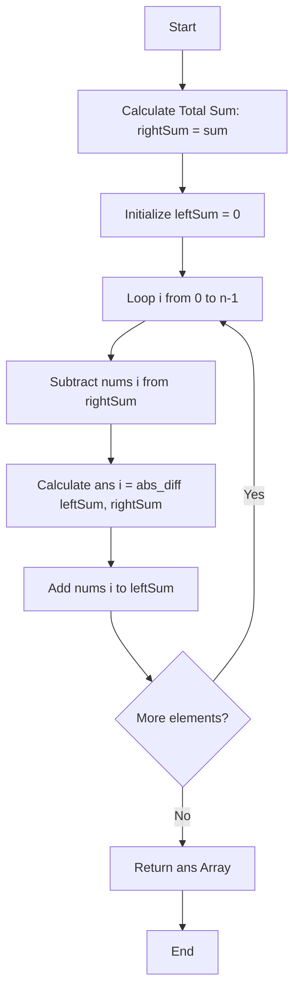

# 💡 Approach — Left and Right Sum Differences

| 📄 [Problem](./Problem.md) | 💡 [Approach](./Approach.md) | 🧩 [Solution](./Solution.cpp) | 🚀 [Main](./Main.cpp) |
|:--------------------------:|:-----------------------------:|:------------------------------:|:---------------------:|

## 📊 Metadata

> [!TIP]
> **Core Insight:** 
> Instead of creating two separate prefix/suffix arrays taking $O(n)$ space, we can compute the total sum of the array and track `leftSum` and `rightSum` dynamically in a single pass. This optimizes the space complexity to $O(1)$!

## 🔩 Step-by-Step Breakdown
1. **Calculate Total Sum:** Iterate through the array to find the total sum. Initially, `rightSum` will be equal to this total sum, and `leftSum` will be $0$.
2. **Initialize Answer Array:** Create an answer vector `ans` of the same size as `nums`.
3. **Iterate and Compute Differences:** For each element at index `i`:
   - First, subtract `nums[i]` from `rightSum` (because `rightSum[i]` only includes elements *strictly* to the right).
   - Calculate the absolute difference `|leftSum - rightSum|` and store it in `answer[i]`.
   - Finally, add `nums[i]` to `leftSum` so it's ready for the next iteration (index `i + 1`).
4. **Return Result:** Once the loop completes, return the generated `answer` array.

## 🔄 Mermaid Flowchart

## 📊 Complexity Analysis
| Complexity | Analysis |
|:---:|:---|
| **Time Complexity** | $$O(n)$$ — We traverse the array twice: once to find the total sum, and once to compute the differences. |
| **Auxiliary Space** | $$O(1)$$ — We use two variables (`leftSum` and `rightSum`) instead of tracking prefix arrays. (Ignoring the required output array). |

> *"Simplicity is prerequisite for reliability."* — Edsger W. Dijkstra

---

<h3>Happy Coding! 🚀</h3>

