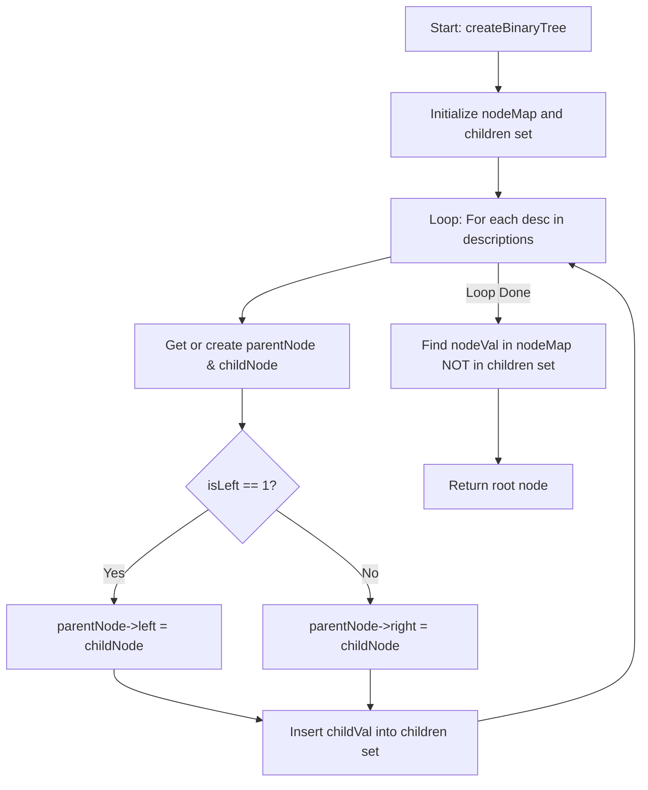

# 💡 Approach — Create Binary Tree From Descriptions

| 📄 [Problem](./Problem.md) | 💡 [Approach](./Approach.md) | 🧩 [Solution](./Solution.cpp) | 🚀 [Main](./Main.cpp) |
|:--------------------------:|:-----------------------------:|:------------------------------:|:---------------------:|

## 📊 Metadata

> [!TIP]
> **Core Insight:** 
> 1. Use a hash map (`unordered_map<int, TreeNode*>`) to store and retrieve created nodes on the fly. This enables linking parents and children in $$O(1)$$ time.
> 2. To identify the root node, keep track of all child node values in a hash set. Since every node in a valid binary tree has exactly one parent except the root, the root will be the only node in the hash map that is **never** recorded as a child.

## 🔩 Step-by-Step Breakdown
1. **Track Nodes and Children:** Maintain an `unordered_map<int, TreeNode*>` to link integer values with their corresponding node pointers, and an `unordered_set<int>` to record all child values.
2. **Build the Tree:** Iterate through the `descriptions` list. For each `[parentVal, childVal, isLeft]`:
   - Retrieve the `parent` node from the map (or create it if it doesn't exist yet).
   - Retrieve the `child` node from the map (or create it if it doesn't exist yet).
   - Link the parent and child: if `isLeft == 1`, set `parent->left = child`; otherwise, set `parent->right = child`.
   - Insert `childVal` into the children set.
3. **Identify the Root:** Iterate through all created nodes in the map. The node whose value is **not** present in the children set is the root of the tree. Return this node.

## 🔄 Mermaid Flowchart

## 📊 Complexity Analysis
| Complexity | Analysis |
|:---:|:---|
| **Time Complexity** | $$O(N)$$ — We iterate through the list of `descriptions` of size $$N$$ once. Finding/inserting in `unordered_map` and `unordered_set` takes $$O(1)$$ on average. Identifying the root requires a scan of the hash map which contains at most $$N + 1$$ nodes. |
| **Auxiliary Space** | $$O(N)$$ — We store at most $$N + 1$$ unique nodes in `nodeMap` and at most $$N$$ child values in the `children` set. |

> *"The structure of a tree is defined not by its height, but by the strength of its roots."*

---

<h3>Happy Coding! 🚀</h3>

