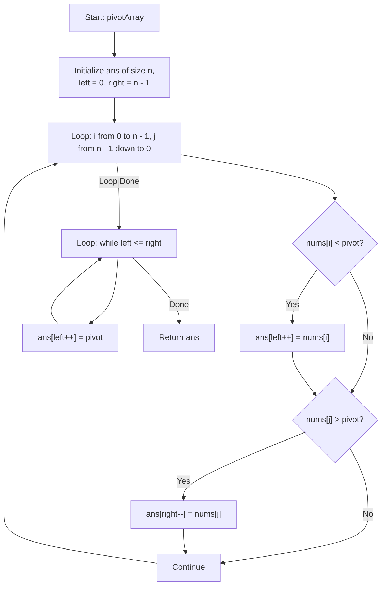

# 💡 Approach — Partition Array According to Given Pivot

| 📄 [Problem](./Problem.md) | 💡 [Approach](./Approach.md) | 🧩 [Solution](./Solution.cpp) | 🚀 [Main](./Main.cpp) |
|:--------------------------:|:-----------------------------:|:------------------------------:|:---------------------:|

## 📊 Metadata

> [!TIP]
> **Core Insight:**
> To rearrange elements such that elements less than `pivot` are placed on the left, elements equal to `pivot` in the middle, and elements greater than `pivot` on the right, while preserving the relative ordering, we can use a **simultaneous two-way two-pointer pass**:
> 
> 1. Use two indices `i` (moving forward from `0` to `n - 1`) and `j` (moving backward from `n - 1` to `0`).
> 2. Maintain a `left` pointer to place elements less than `pivot` from the start of the output array, and a `right` pointer to place elements greater than `pivot` from the end of the output array.
> 3. During the pass:
>    - When checking forward at index `i`, if `nums[i] < pivot`, we place it at index `left++` in the output array. This naturally preserves the forward relative order.
>    - When checking backward at index `j`, if `nums[j] > pivot`, we place it at index `right--` in the output array. Because we traverse from right to left and populate from right to left, the relative order of elements greater than the pivot is also perfectly maintained!
> 4. Finally, any remaining unoccupied slots between `left` and `right` are filled with the `pivot` value.

## 🔩 Step-by-Step Breakdown

1. **Step 1: Initialize Pointers & Variables**
   - Get the size of the array `n`.
   - Create a result array `ans` of the same size.
   - Set `left = 0` (to track where to place elements `< pivot`) and `right = n - 1` (to track where to place elements `> pivot`).
2. **Step 2: Dual-Pass Execution**
   - Traverse the input array simultaneously with index `i` going from `0` to `n - 1` and `j` going from `n - 1` down to `0`.
   - If `nums[i] < pivot`, assign `ans[left++] = nums[i]`.
   - If `nums[j] > pivot`, assign `ans[right--] = nums[j]`.
3. **Step 3: Populate Pivot Values**
   - Fill the remaining indices between `left` and `right` (inclusive) with the `pivot` value.
   - Return the reconstructed `ans` array.

## 🔄 Mermaid Flowchart

## 📊 Complexity Analysis

| Complexity | Analysis |
|:---:|:---|
| **Time Complexity** | $$O(N)$$ — A single iteration traverses the array of size $$N$$ once. Placing remaining pivots takes at most $$N$$ operations. Thus, overall time is strictly linear. |
| **Auxiliary Space** | $$O(1)$$ — We construct the result array `ans` of size $$N$$ to hold the output, which is required. No other dynamic data structures are used, making the auxiliary space usage constant. |

> *"Order is not about sorting, but about keeping every piece in its rightful relative place."*

---

<h3>Happy Coding! 🚀</h3>

