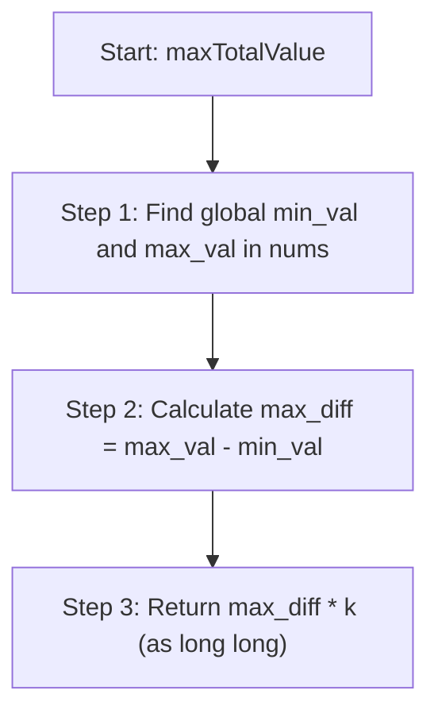

# 💡 Approach — Maximum Total Subarray Value I

| 📄 [Problem](./Problem.md) | 💡 [Approach](./Approach.md) | 🧩 [Solution](./Solution.cpp) | 🚀 [Main](./Main.cpp) |
|:--------------------------:|:-----------------------------:|:------------------------------:|:---------------------:|

## 📊 Metadata

> [!TIP]
> **Core Insight:**
> The value of a subarray is defined as its maximum element minus its minimum element. We want to choose exactly $k$ subarrays to maximize the sum of their values.
> 
> Crucially, we can choose the **exact same subarray multiple times**, and the subarrays can overlap. This means that to maximize the total sum, we should find the single subarray with the largest possible value and choose it all $k$ times!
> 
> The maximum possible value for any subarray in the entire array is the difference between the **global maximum** and the **global minimum**. A subarray that starts at the position of the global minimum and ends at the position of the global maximum (or vice versa) will contain both elements. Its value will be `global_max - global_min`. No subarray can have a value larger than this difference.
> 
> Thus, the maximum possible total value is simply:
> $$\text{Total Value} = ( \text{global\_max} - \text{global\_min} ) \times k$$

## 🔩 Step-by-Step Breakdown

1. **Step 1: Find Global Minimum and Maximum**
   - Traverse the array `nums` to find the minimum value `min_val` and maximum value `max_val`. This can be done efficiently in a single pass using standard algorithms like `std::minmax_element` in C++.

2. **Step 2: Calculate Maximum Subarray Value**
   - Compute the difference `max_val - min_val`. This represents the largest possible value that any individual subarray can have.

3. **Step 3: Multiply by $k$**
   - Since we can select the same subarray $k$ times, the result is `(max_val - min_val) * (long long)k`. Ensure to cast the calculation to 64-bit integer (`long long`) to prevent overflow.

## 🔄 Mermaid Flowchart

## 📊 Complexity Analysis

| Complexity | Analysis |
|:---:|:---|
| **Time Complexity** | $$O(n)$$ — Finding the minimum and maximum elements in the array requires a single traversal of size $$n$$. |
| **Auxiliary Space** | $$O(1)$$ — Only a few constant space variables are used, and the operations are performed in-place. |

> *"Simplicity is the ultimate sophistication." — Leonardo da Vinci*

---

<h3>Happy Coding! 🚀</h3>

