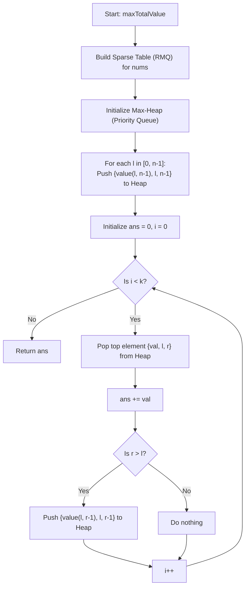

# 💡 Approach — Maximum Total Subarray Value II

| 📄 [Problem](./Problem.md) | 💡 [Approach](./Approach.md) | 🧩 [Solution](./Solution.cpp) | 🚀 [Main](./Main.cpp) |
|:--------------------------:|:-----------------------------:|:------------------------------:|:---------------------:|

## 📊 Metadata

> [!TIP]
> **Core Insight:**
> The value of a subarray `nums[l..r]` is defined as $\max(\text{nums}[l..r]) - \min(\text{nums}[l..r])$.
> For a fixed left boundary $l$, as $r$ increases from $l$ to $n-1$:
> - The range maximum $\max(\text{nums}[l..r])$ is monotonically non-decreasing.
> - The range minimum $\min(\text{nums}[l..r])$ is monotonically non-increasing.
> - Therefore, the subarray value $\max - \min$ is **monotonically non-decreasing** as $r$ increases.
> 
> This monotonic property allows us to view the problem as selecting the top $k$ values from $n$ sorted sequences (one sequence for each starting index $l$).
> - For any $l$, the largest value is at $r = n-1$.
> - If we select `nums[l..r]`, the next largest element in the sequence starting at $l$ must be `nums[l..r-1]`.
> 
> We can precompute range queries in $O(1)$ time using a **Sparse Table (RMQ)**. By utilizing a **Max-Heap (Priority Queue)**, we can extract the globally largest subarray value, add it to our total, and insert its next-largest predecessor in $O(\log n)$ time.

## 🔩 Step-by-Step Breakdown

1. **Step 1: Preprocess Range Query Structure**
   - Initialize a Sparse Table over the array `nums` to support $O(1)$ range maximum and range minimum queries.

2. **Step 2: Initialize Priority Queue with candidates**
   - For each starting index $l$ from $0$ to $n-1$, compute the value of the subarray `nums[l..n-1]` (which is the maximum possible value starting at $l$).
   - Push `{value, l, n-1}` into a Max-Heap.

3. **Step 3: Greedily extract top $k$ subarrays**
   - Keep a running sum of values. Repeat $k$ times:
     - Pop the top candidate `{value, l, r}` from the heap.
     - Add `value` to the total sum.
     - If $r > l$ (meaning there are still smaller subarrays starting at $l$), compute the value of `nums[l..r-1]` and push `{next_value, l, r-1}` to the heap.

## 🔄 Mermaid Flowchart

## 📊 Complexity Analysis

| Complexity | Analysis |
|:---:|:---|
| **Time Complexity** | $$O((n + k) \log n)$$ — Building the Sparse Table takes $$O(n \log n)$$. Initializing the heap takes $$O(n \log n)$$. Greedily popping and pushing $$k$$ times takes $$O(k \log n)$$ time. |
| **Auxiliary Space** | $$O(n \log n)$$ — Storing the Sparse Table transitions for range minimum and maximum requires $$O(n \log n)$$ space. |

> *"Simplicity is the soul of efficiency." — Austin Freeman*

---

<h3>Happy Coding! 🚀</h3>

