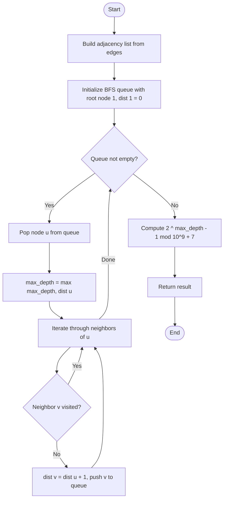

# 💡 Approach — BFS and Combinatorics

| 📄 [Problem](./Problem.md) | 💡 [Approach](./Approach.md) | 🧩 [Solution](./Solution.cpp) | 🚀 [Main](./Main.cpp) |

## 📊 Metadata
- **Difficulty:** 
- **Acceptance Rate:** 
- **Submissions:** 
- **Topics:**   

---

## 💡 Core Insight
> [!TIP]
> **Core Insight:**  
> 1. **Focus on the Path**: The problem states we must choose *any one* node $x$ at the maximum depth, and count the number of valid weight assignments only along the path from root $1$ to $x$. All other edges are ignored.
> 2. **Condition for Odd Cost**: If the path has $d$ edges, and we assign a weight of either $1$ (odd) or $2$ (even) to each edge, the total path sum will be odd if and only if an **odd number of edges** are assigned weight $1$. 
> 3. **Combinatorial Identity**: The number of ways to choose an odd number of edges to have weight $1$ out of $d$ total edges is:
>    $$\sum_{k \text{ is odd}} \binom{d}{k} = 2^{d - 1}$$
> 4. **Finding Max Depth**: Since all maximum-depth nodes have the same depth $d$, we simply need to find the maximum distance $d$ (in terms of edges) from the root $1$ to any node in the tree using a Breadth-First Search (BFS) or Depth-First Search (DFS). The answer will then be $2^{d-1} \pmod{10^9 + 7}$.

---

## 🔩 Step-by-Step Breakdown

### Step 1: Count Nodes
- Since a valid tree has $n$ nodes and $n - 1$ edges, we determine $n = \text{edges.size()} + 1$.

### Step 2: Build Adjacency List
- Construct an undirected adjacency list graph from the list of edges.

### Step 3: Run Breadth-First Search (BFS)
- Initialize a queue with root node `1`, and set its distance/depth to `0`.
- Maintain a visited distance array to avoid cycles and track depths.
- Keep updating `max_depth = max(max_depth, current_depth)` as nodes are processed.

### Step 4: Modular Exponentiation
- Compute $2^{d-1} \pmod{10^9 + 7}$ using binary exponentiation in $\mathcal{O}(\log d)$ time to prevent integer overflow.

---

## 🔄 Mermaid Flowchart

---

## 📊 Complexity Analysis

| Complexity | Analysis |
| :--- | :--- |
| **Time Complexity** | $\mathcal{O}(N)$, where $N$ is the number of nodes. Building the adjacency list and running the BFS visits each node and edge exactly once. Computing the binary power takes $\mathcal{O}(\log N)$ time, which is negligible. |
| **Space Complexity** | $\mathcal{O}(N)$ to store the adjacency list representation of the tree, the distance array, and the BFS queue. |

---

> *"The beauty of a tree is in its branching structure, but the elegance of path problems lies in reducing them to simple lines."*

---

<h3>Happy Coding! 🚀</h3>

