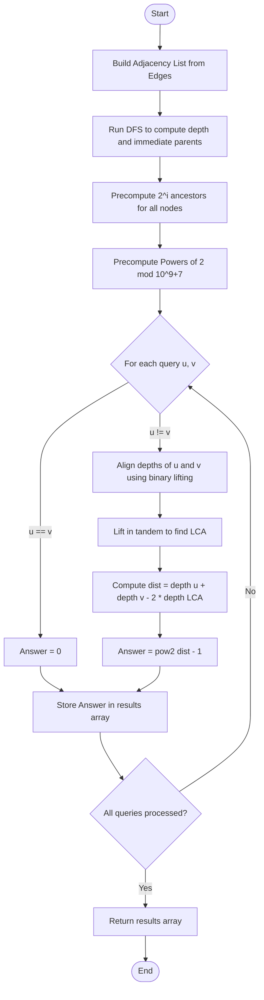

# 💡 Approach — Binary Lifting (LCA) and Combinatorics

| 📄 [Problem](./Problem.md) | 💡 [Approach](./Approach.md) | 🧩 [Solution](./Solution.cpp) | 🚀 [Main](./Main.cpp) |
|:--------------------------:|:-----------------------------:|:------------------------------:|:---------------------:|

## 📊 Metadata
- **Difficulty:** 
- **Acceptance Rate:** 
- **Submissions:** 
- **Topics:**    

---

## 💡 Core Insight
> [!TIP]
> **Core Insight:**  
> 1. **Path-Based Problem**: For each query $[u, v]$, we are asked to assign weights of $1$ (odd) or $2$ (even) only to the edges on the unique path between $u$ and $v$. All other edges in the tree are disregarded.
> 2. **Combinatorial Odd Sum**: Let $k$ be the number of edges on the path. The total cost is odd if and only if we assign an **odd number of edges** to have weight $1$ (since the weight of the remaining edges is $2$, which is even and doesn't change parity).
>    - If $k = 0$ (meaning $u = v$), there are $0$ edges, so the sum is always $0$ (even). Hence, $0$ ways.
>    - If $k \ge 1$, the number of ways to choose an odd number of edges to have weight $1$ out of $k$ total edges is:
>      $$\sum_{i \text{ is odd}} \binom{k}{i} = 2^{k-1}$$
> 3. **Distance Calculation**: The distance $k = dist(u, v)$ in a tree is:
>    $$dist(u, v) = depth[u] + depth[v] - 2 \times depth[LCA(u, v)]$$
> 4. **Query Performance**: Since $N, Q \le 10^5$, we must compute LCA efficiently. By precalculating binary lifting parent pointers up to $O(\log N)$, we can answer each LCA query in $O(\log N)$ time, and precompute powers of 2 for $O(1)$ calculations.

---

## 🔩 Step-by-Step Breakdown

### Step 1: Precompute Tree Depths and Binary Lifting Table
- Construct an adjacency list.
- Run a Depth-First Search (DFS) starting from root node `1` to compute:
  - `depth[u]`: Distance from root node 1 to node $u$.
  - `up[u][0]`: The immediate parent of node $u$.
- Build the binary lifting table `up[u][i]` representing the $2^i$-th ancestor of node $u$:
  $$\text{up}[u][i] = \text{up}[\text{up}[u][i - 1]][i - 1]$$

### Step 2: Precompute Powers of 2
- Construct a lookup table `pow2[i]` where $\text{pow2}[i] = 2^i \pmod{10^9 + 7}$ up to $N$.

### Step 3: Find Lowest Common Ancestor (LCA)
- For each query $[u, v]$:
  - If $u = v$, the distance is 0. Immediately record `0` as the answer.
  - If $u \neq v$, align the depths of $u$ and $v$ by lifting the deeper node by the depth difference.
  - Lift both nodes in tandem using the binary lifting table until they share the same immediate parent.
  - The Lowest Common Ancestor is the parent of the lifted nodes.

### Step 4: Calculate Path Distance and Result
- Use the formula:
  $$dist(u, v) = depth[u] + depth[v] - 2 \times depth[LCA(u, v)]$$
- Return `pow2[dist - 1]`.

---

## 🔄 Mermaid Flowchart

---

## 📊 Complexity Analysis

| Complexity | Analysis |
| :--- | :--- |
| **Time Complexity** | **Preprocessing**: $\mathcal{O}(N \log N)$ to run DFS and compute the binary lifting table of size $N \times \log N$. **Queries**: $\mathcal{O}(Q \log N)$ as each query takes $\mathcal{O}(\log N)$ to find the Lowest Common Ancestor.  **Total Time Complexity**: $\mathcal{O}((N + Q) \log N)$. |
| **Space Complexity** | **Storage**: $\mathcal{O}(N \log N)$ to store the binary lifting table.  **Total Space Complexity**: $\mathcal{O}(N \log N)$. |

---

> *"The shortest distance between two points in a tree passes through their common roots, much like our understanding of complex problems stems from their simplest foundations."*

---

<h3>Happy Coding! 🚀</h3>

