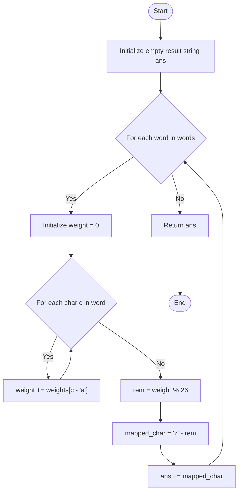

# 💡 Approach — Weighted Sum Simulation

| 📄 [Problem](./Problem.md) | 💡 [Approach](./Approach.md) | 🧩 [Solution](./Solution.cpp) | 🚀 [Main](./Main.cpp) |
|:--------------------------:|:-----------------------------:|:------------------------------:|:---------------------:|

## 📊 Metadata
- **Difficulty:** 
- **Acceptance Rate:** 
- **Submissions:** 
- **Topics:**   

---

## 💡 Core Insight
> [!TIP]
> **Core Insight:**  
> 1. **Word-by-Word Character Weight Summing**: Every character $c$ has a mapped weight. We can retrieve the weight using `weights[c - 'a']`. For each word, its total weight is the sum of weights of its characters.
> 2. **Modular Arithmetic**: Calculating the index using `total_weight % 26` wraps the weight into the range $[0, 25]$.
> 3. **Reverse Alphabetical Mapping**: A standard alphabetical mapping starts at `'a'` (index 0) and ends at `'z'` (index 25). The reverse alphabetical order maps $0 \rightarrow \text{'z'}$, $1 \rightarrow \text{'y'}$, $\dots$, $25 \rightarrow \text{'a'}$.
>    - The mapped character is simply:
>      $$\text{mapped\_char} = \text{'z'} - (\text{weight} \pmod{26})$$

---

## 🔩 Step-by-Step Breakdown

### Step 1: Iterate over each word
- Start by initializing an empty result string `ans`.
- Loop through each word in the input array `words`.

### Step 2: Calculate word weight
- For each word, initialize `weight = 0`.
- Iterate through each character `c` of the word and accumulate its weight:
  $$\text{weight} += \text{weights}[c - \text{'a'}]$$

### Step 3: Map weight modulo 26
- Compute the remainder of the total weight divided by $26$:
  $$\text{rem} = \text{weight} \pmod{26}$$
- Map the remainder to the reverse alphabetical character:
  $$\text{mapped\_char} = \text{'z'} - \text{rem}$$

### Step 4: Accumulate and return
- Append `mapped_char` to `ans`.
- Once all words are processed, return the final concatenated string `ans`.

---

## 🔄 Mermaid Flowchart

---

## 📊 Complexity Analysis

| Complexity | Analysis |
| :--- | :--- |
| **Time Complexity** | $\mathcal{O}(L)$, where $L$ is the sum of the lengths of all strings in `words`. We process each character of every word exactly once to compute its weight. |
| **Space Complexity** | $\mathcal{O}(1)$ auxiliary space (excluding the output string space), since we only use a few integer variables (`weight`, `rem`) for calculation. |

---

> *"Simplicity is the soul of efficiency, and clear mappings guide us through complex transformations."*

---

<h3>Happy Coding! 🚀</h3>

