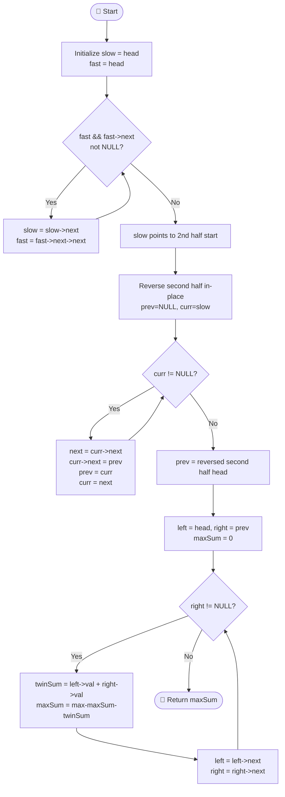

# 💡 Approach — Maximum Twin Sum of a Linked List

| 📄 [Problem](./Problem.md) | 💡 [Approach](./Approach.md) | 🧩 [Solution](./Solution.cpp) | 🚀 [Main](./Main.cpp) |
|:--------------------------:|:-----------------------------:|:------------------------------:|:---------------------:|

---

## 📊 Metadata

---

## 🧠 Core Insight

> [!TIP]
> The key observation is that the **twin of node `i` is node `n-1-i`**, which means we're pairing the **first half** with the **reversed second half**.
> If we reverse the second half of the linked list in place, we can simultaneously walk from the front and the (reversed) back with two pointers — computing each twin sum in O(1) space, O(n) time.

---

## 🔩 Step-by-Step Breakdown

**Step 1 — Find the Middle using Slow & Fast Pointers**
- Use `slow` (advances 1 step) and `fast` (advances 2 steps) pointers.
- When `fast` reaches the end, `slow` is at the midpoint (start of second half).

**Step 2 — Reverse the Second Half**
- Starting at `slow`, reverse the remaining linked list in-place.
- Use the standard 3-pointer reversal: `prev`, `curr`, `next`.

**Step 3 — Two-Pointer Twin Sum Sweep**
- Set `left = head` (start of first half) and `right = reversed_head` (start of reversed second half).
- Advance both simultaneously, computing `left->val + right->val` at each step.
- Track the running maximum.

**Step 4 — Return the Maximum Twin Sum**
- After `n/2` iterations, the maximum twin sum is the answer.

---

## 🔄 Mermaid Flowchart

---

## 📊 Complexity Analysis

| Metric         | Value  | Reason                                                        |
|:--------------:|:------:|:--------------------------------------------------------------|
| 🕐 Time        | O(n)   | One pass to find mid + one pass to reverse + one pass to scan |
| 💾 Space       | O(1)   | In-place reversal; only a handful of pointer variables used   |

---

> *"First, solve the problem. Then, write the code."*
> — John Johnson

---

<h3>Happy Coding! 🚀</h3>

