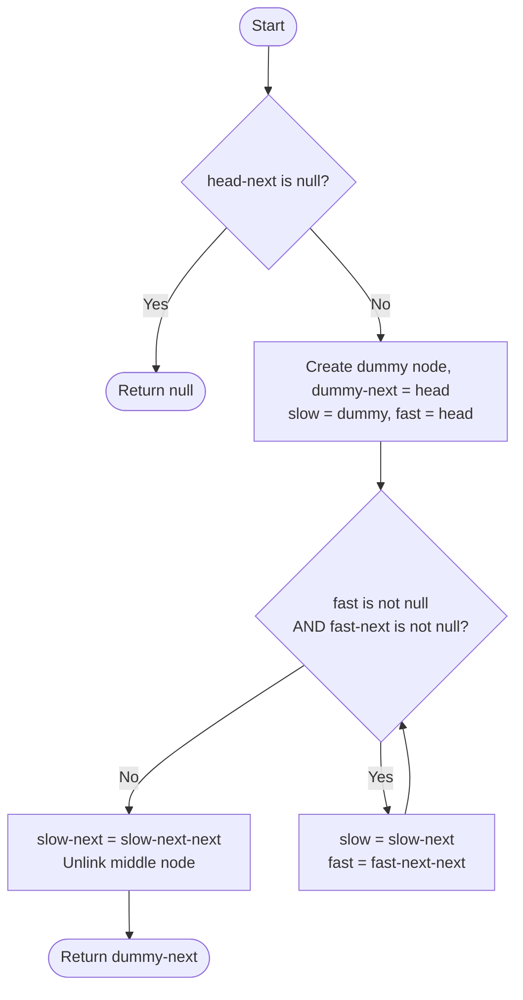

# 💡 Approach — Delete the Middle Node of a Linked List

| 📄 [Problem](./Problem.md) | 💡 [Approach](./Approach.md) | 🧩 [Solution](./Solution.cpp) | 🚀 [Main](./Main.cpp) |
|:--------------------------:|:-----------------------------:|:------------------------------:|:---------------------:|

---

## 📊 Metadata

---

## 🎯 Core Insight

> [!TIP]
> To delete the middle node without knowing `n` upfront, use the **Slow & Fast Two-Pointer** technique.
> Attach a **dummy node** before `head` so that `slow` starts one step behind the list.
> Move `fast` two steps and `slow` one step per iteration. When `fast` falls off the end,
> `slow` lands exactly on the node **before** the middle — allowing a clean `O(1)` deletion.
> No second pass needed; the entire operation is single-pass `O(n)` with `O(1)` space.

---

## 🔩 Step-by-Step Breakdown

**Step 1 — Handle the single-node edge case**
- If `head->next == nullptr`, the list has only one node; deleting its middle means deleting it entirely. Return `nullptr`.

**Step 2 — Attach a dummy node**
- Create a `dummy` node whose `next` points to `head`.
- Initialize `slow = dummy` and `fast = head`.
- Starting `slow` at `dummy` gives it a one-node head-start, so it stops at the node *before* the middle.

**Step 3 — Advance pointers**
- While `fast != nullptr && fast->next != nullptr`:
  - Move `slow` one step forward.
  - Move `fast` two steps forward.
- When the loop ends, `slow->next` is the middle node to be deleted.

**Step 4 — Unlink the middle node**
- Set `slow->next = slow->next->next` to skip over the middle node.

**Step 5 — Return the modified list**
- Return `dummy->next` (the true head, unchanged).

---

## 🔄 Mermaid Flowchart

---

## 🧮 Dry Run — Example 1

List: `1 → 3 → 4 → 7 → 1 → 2 → 6`, n = 7, target middle index = 3 (value **7**)

| Step | slow (idx) | fast (idx) |
|:----:|:----------:|:----------:|
| Init | dummy (-1) | 0 (val=1)  |
|  1   |  0 (val=1) | 2 (val=4)  |
|  2   |  1 (val=3) | 4 (val=1)  |
|  3   |  2 (val=4) | 6 (val=6)  |

`fast->next = null` → stop. `slow` at index 2 (val=4).
`slow->next = slow->next->next` → skip index 3 (val=**7**) → `[1,3,4,1,2,6]` ✅

---

## 📊 Complexity Analysis

| Metric    | Value   | Reasoning                                           |
|:---------:|:-------:|:---------------------------------------------------:|
| 🕐 Time   | $O(n)$  | Single pass through the list with two pointers      |
| 💾 Space  | $O(1)$  | Only two pointer variables + one dummy node used    |

---

> *"Two pointers moving at different speeds — one of the most elegant ideas in computer science."*

---

<h3>Happy Coding! 🚀</h3>

