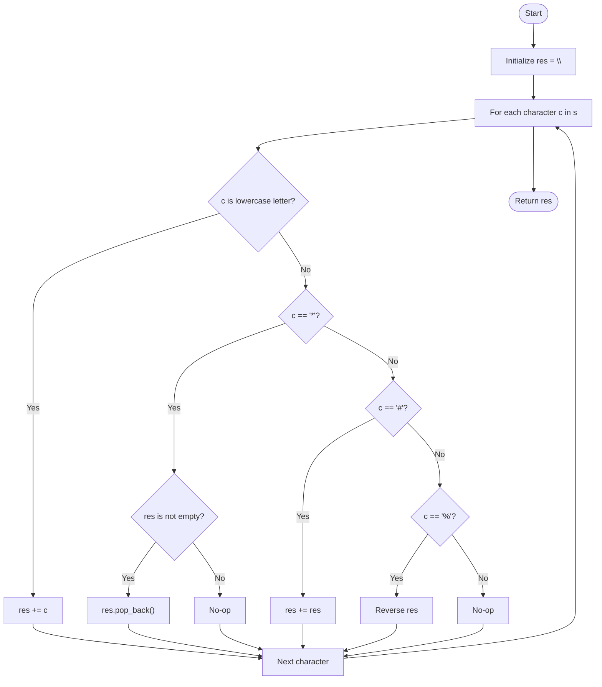

# 💡 Approach — Process String with Special Operations I

| 📄 [Problem](./Problem.md) | 💡 [Approach](./Approach.md) | 🧩 [Solution](./Solution.cpp) | 🚀 [Main](./Main.cpp) |
|:--------------------------:|:-----------------------------:|:------------------------------:|:---------------------:|

---

## 📊 Metadata

---

## 🎯 Core Insight

> [!TIP]
> **Straightforward Left-to-Right Simulation** is the most optimal approach.
> 
> Because the constraint on the string length is extremely small ($1 \le s.\text{length} \le 20$), even the worst-case scenario where we duplicate the string repeatedly is highly manageable.
> Specifically, if the string has 1 character followed by 19 `#` operations, the final string length will be $2^{19} = 524,288$ characters. This easily fits in memory (around 500 KB) and can be processed in just a few milliseconds.
> Thus, simulating the string operations sequentially using standard string API calls (`push_back()`, `pop_back()`, string concatenation, and `std::reverse`) is efficient and clean.

---

## 🔩 Step-by-Step Breakdown

**Step 1 — Initialize result string**
- Create an empty string `res` to store the processed characters.

**Step 2 — Iterate through characters**
- Loop through each character `c` of the string `s`:
  - **Step 2.1 — Lowercase English letter**: If `c` is a lowercase letter, append it to `res` (`res += c`).
  - **Step 2.2 — Asterisk (`*`)**: If `c` is `'*'` and `res` is not empty, remove the last character (`res.pop_back()`).
  - **Step 2.3 — Hash (`#`)**: If `c` is `'#'`, double the current string by appending it to itself (`res += res`).
  - **Step 2.4 — Percent (`%`)**: If `c` is `'%'`, reverse the string `res` using `std::reverse`.

**Step 3 — Return result**
- Return the final processed string `res`.

---

## 🔄 Mermaid Flowchart

---

## 🧮 Dry Run — Example 1

`s = "a#b%*"`

| Character `c` | Operation type | Action taken | `res` State |
|:---:|:---:|:---:|:---:|
| **Initial** | — | — | `""` |
| `'a'` | Letter | Append `'a'` | `"a"` |
| `'#'` | Duplicate | `"a" + "a"` | `"aa"` |
| `'b'` | Letter | Append `'b'` | `"aab"` |
| `'%'` | Reverse | Reverse `"aab"` | `"baa"` |
| `'*'` | Remove last | Pop last character | **`"ba"`** ✅ |

---

## 📊 Complexity Analysis

| Metric | Value | Reasoning |
|:---:|:---:|:---:|
| 🕐 Time | $O(N \cdot 2^N)$ | In the worst-case (all `#` operations), the string doubles at each step, and reversing takes time proportional to the length of the string. Since $N \le 20$, this is extremely fast. |
| 💾 Space | $O(2^N)$ | Auxiliary space required to store the duplicated characters in the result string. |

---

> *"Simulation is the art of imitating reality step-by-step to find the ultimate truth."*

---

<h3>Happy Coding! 🚀</h3>

