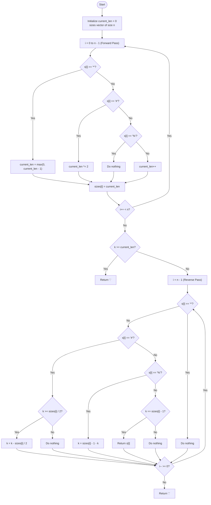

# 💡 Approach — Process String with Special Operations II

| 📄 [Problem](./Problem.md) | 💡 [Approach](./Approach.md) | 🧩 [Solution](./Solution.cpp) | 🚀 [Main](./Main.cpp) |
|:--------------------------:|:-----------------------------:|:------------------------------:|:---------------------:|

---

## 📊 Metadata

---

## 🎯 Core Insight

> [!TIP]
> **Reverse simulation** is the key! Since the output string can reach a length of $$10^{15}$$ characters, we cannot construct it in memory. Instead, we can trace the target index `k` **backwards** from the final state to the original character that generated it.
> 
> 1. **Forward Pass (Determine Sizes):** Calculate the length of the string at every step.
>    - A letter adds $1$ to the length.
>    - A `*` subtracts $1$ from the length (minimum length is $0$).
>    - A `#` doubles the length.
>    - A `%` keeps the length unchanged.
> 
> 2. **Reverse Pass (Track Index $k$ Backwards):** Start from the last operation and trace $k$ backwards:
>    - **Lowercase letter:** If $k$ is pointing to the last character of the current prefix (`k == sizes[i] - 1`), then the current letter $s[i]$ is our answer!
>    - **`#` (Duplicate):** The string was duplicated. If $k$ lies in the second half ($k \ge \text{sizes}[i] / 2$), we shift it back by subtracting the size of the first half ($k \leftarrow k - \text{sizes}[i] / 2$).
>    - **`%` (Reverse):** Symmetrically flip the index $k$ based on the current length ($k \leftarrow \text{sizes}[i] - 1 - k$).
>    - **`*` (Remove):** Ignore it because the forward pass already adjusted the length.

---

## 🔩 Step-by-Step Breakdown

**Step 1 — Forward Pass: Compute and store string lengths**
- Initialize `current_len = 0` and a vector `sizes` of size $n$.
- Traverse the string from left to right:
  - If $s[i] == '*'$: Decrement `current_len` if it's greater than 0.
  - Else if $s[i] == '\#'$: Double `current_len`.
  - Else if $s[i] == '\%'$: Keep `current_len` unchanged.
  - Else (lowercase letter): Increment `current_len`.
  - Store `sizes[i] = current_len`.

**Step 2 — Boundary Check**
- If $k \ge \text{current\_len}$ or $k < 0$, the index is out of bounds. Return `'.'`.

**Step 3 — Reverse Pass: Trace index $k$ backwards**
- Iterate from $i = n - 1$ down to $0$:
  - If $s[i] == '*'$: Do nothing (continue).
  - Else if $s[i] == '\#'$: If $k \ge \text{sizes}[i] / 2$, update $k = k - \text{sizes}[i] / 2$.
  - Else if $s[i] == '\%'$: Update $k = \text{sizes}[i] - 1 - k$.
  - Else (lowercase letter): If $k == \text{sizes}[i] - 1$, return $s[i]$.

---

## 🔄 Mermaid Flowchart

---

## 🧮 Dry Run — Example 2

`s = "cd%#*#"`, `k = 3`

### 1. Forward Pass (Compute Sizes)
| $i$ | `s[i]` | Operation | `current_len` | `sizes` array |
|:---:|:---:|:---|:---:|:---|
| 0 | `'c'` | Append | 1 | `[1]` |
| 1 | `'d'` | Append | 2 | `[1, 2]` |
| 2 | `'%'` | Reverse | 2 | `[1, 2, 2]` |
| 3 | `'#'` | Duplicate | 4 | `[1, 2, 2, 4]` |
| 4 | `'*'` | Remove | 3 | `[1, 2, 2, 4, 3]` |
| 5 | `'#'` | Duplicate | 6 | `[1, 2, 2, 4, 3, 6]` |

---

### 2. Reverse Pass (Trace $k = 3$ Backwards)
- Start with $k = 3$. Target length = 6. Since $3 < 6$, it's in bounds.
- **$i = 5$ (`'#'`):** `sizes[5] = 6`. $k = 3 \ge 3$ (True). Update $k = 3 - 3 = 0$.
- **$i = 4$ (`'*'`):** Ignore.
- **$i = 3$ (`'#'`):** `sizes[3] = 4`. $k = 0 \ge 2$ (False). No change.
- **$i = 2$ (`'%'`):** `sizes[2] = 2`. Update $k = 2 - 1 - 0 = 1$.
- **$i = 1$ (`'d'`):** `sizes[1] = 2`. $k = 1 == 2 - 1$ (True). Return `'d'`. ✅

---

## 📊 Complexity Analysis

| Metric | Value | Reasoning |
|:---:|:---:|:---:|
| 🕐 Time | $$O(n)$$ | We make one forward pass of length $n$ and one reverse pass of length $n$. |
| 💾 Space | $$O(n)$$ | We store the prefix sizes of the string in a vector of size $n$. |

---

> *"Working backwards from the end is often the fastest path to the beginning."*

---

<h3>Happy Coding! 🚀</h3>

