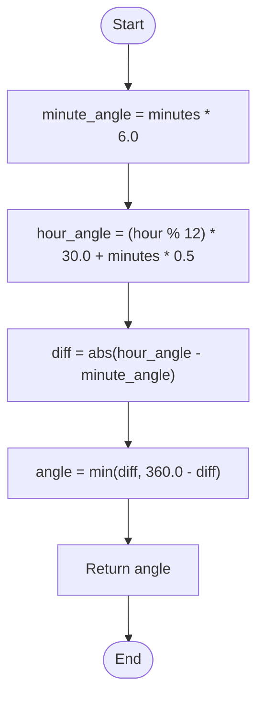

# 💡 Approach — Angle Between Hands of a Clock

| 📄 [Problem](./Problem.md) | 💡 [Approach](./Approach.md) | 🧩 [Solution](./Solution.cpp) | 🚀 [Main](./Main.cpp) |
|:--------------------------:|:-----------------------------:|:------------------------------:|:---------------------:|

---

## 📊 Metadata

---

## 🎯 Core Insight

> [!TIP]
> **Use Coordinate Reference System** from 12 o'clock ($0^\circ$) to measure hand angles and calculate the absolute difference.
> 
> Let's analyze the rate of movement of both hands:
> 
> 1. **Minute Hand:**
>    - A full rotation takes 60 minutes, which corresponds to $360^\circ$.
>    - Rate = $360^\circ / 60 = 6^\circ$ per minute.
>    - Position: $\text{minutes} \times 6$.
> 
> 2. **Hour Hand:**
>    - A full rotation takes 12 hours ($360^\circ$).
>    - Rate = $360^\circ / 12 = 30^\circ$ per hour.
>    - Additionally, as minutes pass, the hour hand moves. In 60 minutes, it travels $30^\circ$ (the distance between two hours).
>    - Fractional Rate = $30^\circ / 60 = 0.5^\circ$ per minute.
>    - Position: $(\text{hour} \bmod 12) \times 30 + \text{minutes} \times 0.5$.
> 
> The smaller angle is the minimum of the absolute difference and the reflex angle ($360^\circ - \text{difference}$).

---

## 🔩 Step-by-Step Breakdown

**Step 1 — Calculate Minute Hand Position**
- Calculate the angle of the minute hand from 12 o'clock: `minute_angle = minutes * 6.0`.

**Step 2 — Calculate Hour Hand Position**
- Treat hour 12 as 0 to measure degrees starting from the top.
- Calculate the angle of the hour hand: `hour_angle = (hour % 12) * 30.0 + minutes * 0.5`.

**Step 3 — Compute the Angle Difference**
- Find the absolute difference between the two angles: `diff = abs(hour_angle - minute_angle)`.

**Step 4 — Return the Smaller Angle**
- Return the minimum of `diff` and `360.0 - diff`.

---

## 🔄 Mermaid Flowchart

---

## 🧮 Dry Run — Example 3

`hour = 3, minutes = 15`

| Step | Operation / Variable | Value | Description |
| :---: | :---: | :---: | :--- |
| **1** | `minute_angle` | $15 \times 6.0 = 90.0^\circ$ | Position of the minute hand. |
| **2** | `hour_angle` | $(3 \bmod 12) \times 30.0 + 15 \times 0.5 = 97.5^\circ$ | Position of the hour hand. |
| **3** | `diff` | $|97.5^\circ - 90.0^\circ| = 7.5^\circ$ | Absolute angular difference. |
| **4** | Return value | $\min(7.5^\circ, 360.0^\circ - 7.5^\circ) = \mathbf{7.5^\circ}$ ✅ | Output the smaller angle. |

---

## 📊 Complexity Analysis

| Metric | Value | Reasoning |
| :---: | :---: | :--- |
| 🕐 Time | $$O(1)$$ | Constantly performs simple arithmetic calculations. |
| 💾 Space | $$O(1)$$ | No auxiliary memory structures are allocated. |

---

> *"Time is geometric; the hands of a clock trace the paths of circular trigonometry."*

---

<h3>Happy Coding! 🚀</h3>

