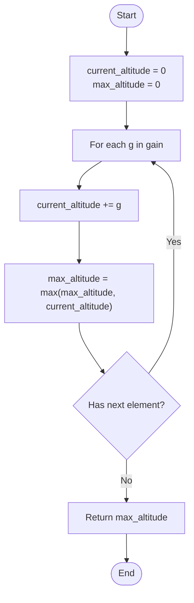

# 💡 Approach — Find the Highest Altitude

| 📄 [Problem](./Problem.md) | 💡 [Approach](./Approach.md) | 🧩 [Solution](./Solution.cpp) | 🚀 [Main](./Main.cpp) |
|:--------------------------:|:-----------------------------:|:------------------------------:|:---------------------:|

---

## 📊 Metadata

---

## 🎯 Core Insight

> [!TIP]
> **Prefix Sum Accumulation:** Since we start at altitude 0, the altitude at any point $$i$$ is the prefix sum of the gains up to $$i-1$$.
> By keeping a running sum of the gains and tracking the maximum value it achieves during traversal, we can determine the highest altitude in $$O(n)$$ time and $$O(1)$$ auxiliary space.

---

## 🔩 Step-by-Step Breakdown

**Step 1: Initialize Altitudes**
- The biker starts at point `0` with altitude equal to `0`. We initialize:
  - `current_altitude = 0` (keeps track of the current altitude)
  - `max_altitude = 0` (stores the highest altitude reached so far)

**Step 2: Iterate through Gains**
- Traverse the given `gain` array of size $$n$$ element by element.

**Step 3: Update Current Altitude**
- For each gain `g`, add it to `current_altitude`: `current_altitude += g`.

**Step 4: Update Maximum Altitude**
- Compare `current_altitude` with `max_altitude`, and update `max_altitude` to store the larger value: `max_altitude = max(max_altitude, current_altitude)`.

**Step 5: Return Result**
- After finishing the traversal, `max_altitude` will hold the highest altitude of a point. Return `max_altitude`.

---

## 🔄 Mermaid Flowchart

---

## 🧮 Dry Run — Example 1

Input: `gain = [-5, 1, 5, 0, -7]`

| Step / Index | Gain `g` | Updated `current_altitude` | Updated `max_altitude` | Description |
|:---:|:---:|:---:|:---:|:---|
| **Start** | — | $$0$$ | $$0$$ | Initialized state at point 0. |
| **0** | $$-5$$ | $$0 + (-5) = -5$$ | $$\max(0, -5) = 0$$ | Biker moves to point 1. |
| **1** | $$1$$ | $$-5 + 1 = -4$$ | $$\max(0, -4) = 0$$ | Biker moves to point 2. |
| **2** | $$5$$ | $$-4 + 5 = 1$$ | $$\max(0, 1) = 1$$ | Biker moves to point 3 (New highest peak!). |
| **3** | $$0$$ | $$1 + 0 = 1$$ | $$\max(1, 1) = 1$$ | Biker moves to point 4. |
| **4** | $$-7$$ | $$1 + (-7) = -6$$ | $$\max(1, -6) = 1$$ | Biker moves to point 5. |

**Final Output:** `1` ✅

---

## 📊 Complexity Analysis

| Metric | Complexity | Reasoning |
| :---: | :---: | :--- |
| 🕐 Time | $$O(n)$$ | We make a single pass through the `gain` array of length $$n$$. |
| 💾 Space | $$O(1)$$ | Only two integer variables are used to keep track of the altitudes. |

---

> *"The peak is just a prefix sum of the steps we take to get there."*

---

<h3>Happy Coding! 🚀</h3>

