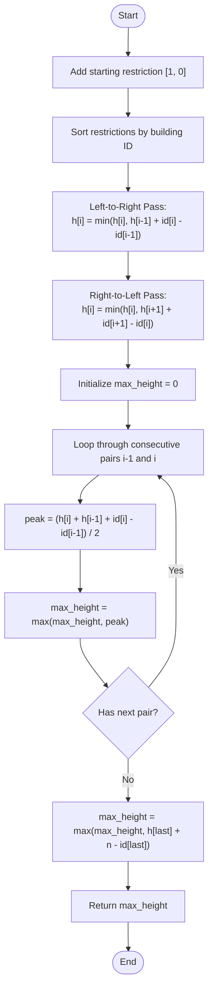

# 💡 Approach — Maximum Building Height

| 📄 [Problem](./Problem.md) | 💡 [Approach](./Approach.md) | 🧩 [Solution](./Solution.cpp) | 🚀 [Main](./Main.cpp) |
|:--------------------------:|:-----------------------------:|:------------------------------:|:---------------------:|

---

## 📊 Metadata

---

## 🎯 Core Insight

> [!TIP]
> **Two-Pass Restriction Propagation (Greedy / Two Pointers):**
> Since building $$1$$ must have height $$0$$, and the height difference between any two adjacent buildings is at most $$1$$, the height of building $$id$$ is naturally bounded by $$id - 1$$.
>
> When restrictions are introduced, they propagate boundaries bidirectionally:
> 1. **Left-to-Right Pass**: A building cannot exceed the height of a restricted building to its left plus the distance between them.
> 2. **Right-to-Left Pass**: A building cannot exceed the height of a restricted building to its right plus the distance between them.
>
> By sorting restrictions, inserting the base state `[1, 0]`, and executing a bidirectional propagation, we can determine the strict maximum height at every restricted location. The absolute peak between any two adjacent restricted buildings $$A$$ and $$B$$ is limited by their meeting point: $$\lfloor \frac{h_A + h_B + (B - A)}{2} \rfloor$$.

---

## 🔩 Step-by-Step Breakdown

**Step 1: Setup and Sort Restrictions**
- Add the starting condition as a restriction: building `1` must have height `0`.
- Sort the `restrictions` list in ascending order of building IDs.

**Step 2: Forward Propagation (Left-to-Right Pass)**
- Traverse the sorted restrictions from left to right.
- For each restriction $$i$$, the height cannot exceed the height at restriction $$i-1$$ plus the distance between them:
  $$h[i] = \min(h[i], h[i-1] + (id[i] - id[i-1]))$$

**Step 3: Backward Propagation (Right-to-Left Pass)**
- Traverse the sorted restrictions from right to left.
- For each restriction $$i$$, the height cannot exceed the height at restriction $$i+1$$ plus the distance between them:
  $$h[i] = \min(h[i], h[i+1] + (id[i+1] - id[i]))$$

**Step 4: Compute Maximum Height Between Adjacent Restrictions**
- For each consecutive pair of restrictions $$i-1$$ and $$i$$:
  - Calculate the peak height they can form between them when building up towards each other as fast as possible (slope of 1):
    $$\text{peak} = \lfloor \frac{h[i] + h[i-1] + (id[i] - id[i-1])}{2} \rfloor$$
  - Keep track of the maximum peak found. Use `long long` to prevent integer overflow.

**Step 5: Handle the Trailing Buildings**
- From the last restricted building at index $$last\_id$$ to the end of the city $$n$$, there are no more restrictions.
- We can increase the height by 1 for each building. The maximum height reached is:
  $$\text{final\_peak} = h[last] + (n - id[last])$$

**Step 6: Return Result**
- Return the maximum of all computed peak heights.

---

## 🔄 Mermaid Flowchart

---

## 🧮 Dry Run — Example 1

Input: `n = 5`, `restrictions = [[2,1],[4,1]]`

### 1. Initialization and Sorting
Add `[1, 0]` and sort:
`[[1, 0], [2, 1], [4, 1]]`

### 2. Bidirectional Propagation

| Pass / Step | Restriction `[id, maxH]` | Formula / Computation | Updated Height |
| :---: | :---: | :--- | :---: |
| **Initial** | `[[1,0], [2,1], [4,1]]` | — | `[0, 1, 1]` |
| **L-to-R: i=1** | `[2, 1]` | $$\min(1, 0 + (2-1)) = 1$$ | `1` |
| **L-to-R: i=2** | `[4, 1]` | $$\min(1, 1 + (4-2)) = 1$$ | `1` |
| **R-to-L: i=1** | `[2, 1]` | $$\min(1, 1 + (4-2)) = 1$$ | `1` |
| **R-to-L: i=0** | `[1, 0]` | $$\min(0, 1 + (2-1)) = 0$$ | `0` |

### 3. Peak Computation

- **Pair 1 (`[1,0]` to `[2,1]`):**
  $$\text{peak} = \lfloor \frac{0 + 1 + (2-1)}{2} \rfloor = \lfloor \frac{2}{2} \rfloor = 1$$
- **Pair 2 (`[2,1]` to `[4,1]`):**
  $$\text{peak} = \lfloor \frac{1 + 1 + (4-2)}{2} \rfloor = \lfloor \frac{4}{2} \rfloor = 2$$
- **Trailing Section (from `[4,1]` to `5`):**
  $$\text{peak} = 1 + (5 - 4) = 2$$

**Final Output:** $$\max(1, 2, 2) = 2$$ ✅

---

## 📊 Complexity Analysis

| Metric | Complexity | Reasoning |
| :---: | :---: | :--- |
| 🕐 Time | $$O(m \log m)$$ | Sorting the $$m$$ restrictions takes $$O(m \log m)$$ time. The two linear scans take $$O(m)$$ time. |
| 💾 Space | $$O(m)$$ | Storing the modified restrictions list of size $$m + 1$$ requires $$O(m)$$ auxiliary space. |

---

> *"To reach the highest peak, we must first bound our limits from both sides."*

---

<h3>Happy Coding! 🚀</h3>

