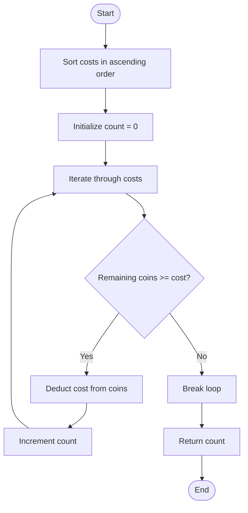

# 💡 Approach — Maximum Ice Cream Bars

| 📄 [Problem](./Problem.md) | 💡 [Approach](./Approach.md) | 🧩 [Solution](./Solution.cpp) | 🚀 [Main](./Main.cpp) |
|:--------------------------:|:-----------------------------:|:------------------------------:|:---------------------:|

---

## 📊 Metadata

---

## 🎯 Core Insight

> [!TIP]
> **Greedy Choice Property:**
> To maximize the number of ice cream bars we can buy, we should always choose to buy the cheapest available ice cream bars first. By sorting the prices in ascending order, we ensure that we consume our limited coins as slowly as possible, which maximizes the quantity bought.

---

## 🔩 Step-by-Step Breakdown

**Step 1: Sort Costs**
- Sort the `costs` array in ascending order so that the cheapest ice cream bars appear first.

**Step 2: Initialize Count**
- Maintain a count variable `count` initialized to `0`.

**Step 3: Buy Ice Cream Bars**
- Iterate through each `cost` in the sorted array:
  - If the remaining `coins` are greater than or equal to the current `cost`, buy it:
    - Deduct `cost` from `coins`.
    - Increment `count` by 1.
  - If we cannot afford the current ice cream bar, we cannot afford any of the subsequent ones either (since the list is sorted). Hence, break the loop immediately.

**Step 4: Return Result**
- Return `count` as the maximum number of ice cream bars purchased.

---

## 🔄 Mermaid Flowchart

---

## 🧮 Dry Run — Example 1

Input: `costs = [1,3,2,4,1]`, `coins = 7`

### 1. Sorting
Sorted `costs` array: `[1, 1, 2, 3, 4]`

### 2. Execution

| Step | Cost | Remaining Coins | Condition: `coins >= cost` | Updated Count | Action |
| :---: | :---: | :---: | :---: | :---: | :--- |
| **Start** | — | `7` | — | `0` | — |
| **1** | `1` | `7 - 1 = 6` | `7 >= 1` (True) | `1` | Buy |
| **2** | `1` | `6 - 1 = 5` | `6 >= 1` (True) | `2` | Buy |
| **3** | `2` | `5 - 2 = 3` | `5 >= 2` (True) | `3` | Buy |
| **4** | `3` | `3 - 3 = 0` | `3 >= 3` (True) | `4` | Buy |
| **5** | `4` | `0` | `0 >= 4` (False) | `4` | Break |

**Final Output:** `4` ✅

---

## 📊 Complexity Analysis

| Metric | Complexity | Reasoning |
| :---: | :---: | :--- |
| 🕐 Time | $$O(n \log n)$$ | Sorting the `costs` array of size $$n$$ dominates the time complexity. The subsequent linear traversal takes $$O(n)$$ time. |
| 💾 Space | $$O(1)$$ | We do not use any additional data structures, so auxiliary space is constant. (If sorting in-place). |

---

> *"Greed is good when you want to buy the maximum number of ice cream bars on a hot summer day."*

---

<h3>Happy Coding! 🚀</h3>

