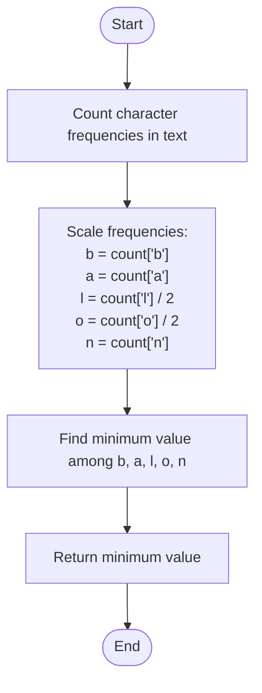

# 💡 Approach — Maximum Number of Balloons

| 📄 [Problem](./Problem.md) | 💡 [Approach](./Approach.md) | 🧩 [Solution](./Solution.cpp) | 🚀 [Main](./Main.cpp) |
|:--------------------------:|:-----------------------------:|:------------------------------:|:---------------------:|

---

## 📊 Metadata

---

## 🎯 Core Insight

> [!TIP]
> **Bottleneck Counting (Frequency Map):**
> A single word "balloon" is composed of:
> - `b` $$\times 1$$
> - `a` $$\times 1$$
> - `l` $$\times 2$$
> - `o` $$\times 2$$
> - `n` $$\times 1$$
> 
> The maximum number of "balloon"s we can form is strictly limited by the character that has the lowest available frequency relative to its requirement. Thus, we count all frequencies, scale down the counts of `l` and `o` by dividing by 2, and find the minimum of all required characters.

---

## 🔩 Step-by-Step Breakdown

**Step 1: Count Character Frequencies**
- Create a frequency array/hash map of size 26 to store the counts of each character in `text`.

**Step 2: Extract Relevant Counts**
- Extract frequencies for:
  - `count_b = freq['b']`
  - `count_a = freq['a']`
  - `count_l = freq['l'] / 2`
  - `count_o = freq['o'] / 2`
  - `count_n = freq['n']`

**Step 3: Return Bottleneck Minimum**
- The maximum number of "balloon"s is `min({count_b, count_a, count_l, count_o, count_n})`.

---

## 🔄 Mermaid Flowchart

---

## 🧮 Dry Run — Example 1

Input: `text = "nlaebolko"`

### 1. Frequency Counting

| Char | `n` | `l` | `a` | `e` | `b` | `o` | `k` |
| :---: | :---: | :---: | :---: | :---: | :---: | :---: | :---: |
| **Count** | `1` | `2` | `1` | `1` | `1` | `2` | `1` |

### 2. Word Scaling

- `b` count: `1`
- `a` count: `1`
- `l` count scaled: `2 / 2 = 1`
- `o` count scaled: `2 / 2 = 1`
- `n` count: `1`

### 3. Bottleneck Calculation
- `min(1, 1, 1, 1, 1) = 1`

**Final Output:** `1` ✅

---

## 📊 Complexity Analysis

| Metric | Complexity | Reasoning |
| :---: | :---: | :--- |
| 🕐 Time | $$O(n)$$ | We perform a single pass over the string `text` of length $$n$$ to count character frequencies. Finding the minimum of 5 values takes $$O(1)$$ time. |
| 💾 Space | $$O(1)$$ | The frequency array is of fixed size 26 (constant auxiliary space). |

---

> *"The strength of a chain is only as strong as its weakest link, and a word only as complete as its scarcest letter."*

---

<h3>Happy Coding! 🚀</h3>

