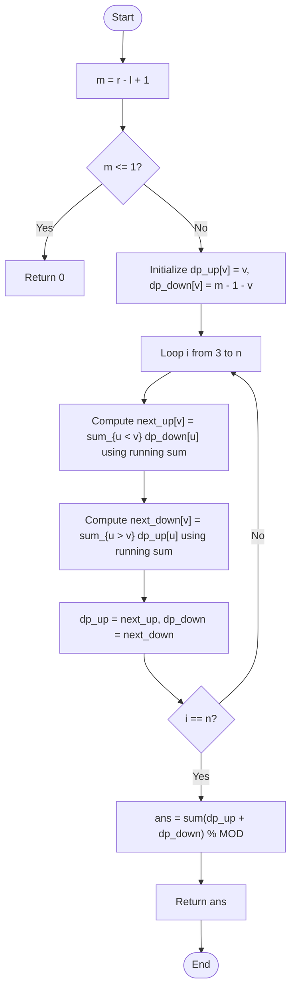

# 💡 Approach — Number of Zigzag Arrays I

| 📄 [Problem](./Problem.md) | 💡 [Approach](./Approach.md) | 🧩 [Solution](./Solution.cpp) | 🚀 [Main](./Main.cpp) |
|:--------------------------:|:-----------------------------:|:------------------------------:|:---------------------:|

---

## 📊 Metadata

---

## 🎯 Core Insight

> [!TIP]
> **Dynamic Programming with Prefix/Suffix Sums:**
> A sequence $A$ of length $i$ ends with some value $v \in [l, r]$. Since it is a Zigzag array, the transition to the next element at index $i+1$ depends on the direction of the last transition:
> - If $A[i-1] < A[i]$ (last transition was **UP**), then $A[i] > A[i+1]$ (next transition must be **DOWN**).
> - If $A[i-1] > A[i]$ (last transition was **DOWN**), then $A[i] < A[i+1]$ (next transition must be **UP**).
> 
> Let $m = r - l + 1$. We define:
> - `dp_up[v]`: number of sequences of length $i$ ending in $v$ where last transition was UP.
> - `dp_down[v]`: number of sequences of length $i$ ending in $v$ where last transition was DOWN.
> 
> Transitioning directly would take $O(m^2)$ per step. By maintaining a running sum (prefix sum of `dp_down` and suffix sum of `dp_up`), we can compute all transitions in $O(m)$ time, giving an overall time complexity of $O(n \cdot m)$.

---

## 🔩 Step-by-Step Breakdown

**Step 1: Setup Base Arrays**
- Map the values in range $[l, r]$ to indices $[0, m-1]$ where $m = r - l + 1$.
- Create two arrays `dp_up` and `dp_down` of size $m$.

**Step 2: Base Case (Length 2)**
- For $n = 2$, any pair of unequal elements is valid:
  - If we end at $v$ via an **UP** transition, the previous element $u$ must be smaller ($u < v$). There are exactly $v$ such elements in range $[0, v-1]$.
    - `dp_up[v] = v`
  - If we end at $v$ via a **DOWN** transition, the previous element $u$ must be larger ($u > v$). There are exactly $m - 1 - v$ such elements in range $[v+1, m-1]$.
    - `dp_down[v] = m - 1 - v`

**Step 3: Fill DP Table (Length 3 to n)**
- For each position $i$ from 3 to $n$, calculate the next state:
  - `next_up[v] = sum_{u < v} dp_down[u]` (running sum from left to right)
  - `next_down[v] = sum_{u > v} dp_up[u]` (running sum from right to left)
- Update `dp_up = next_up` and `dp_down = next_down` at the end of each iteration. Use modulo $10^9 + 7$ for all additions.

**Step 4: Compute Total Answer**
- Sum up all entries in `dp_up` and `dp_down` for the final array of length $n$.

---

## 🔄 Mermaid Flowchart

---

## 🧮 Dry Run — Example 1

Input: `n = 3, l = 4, r = 5` $\implies m = 2$.

### 1. Base Case ($n = 2$)

- `dp_up = [0, 1]`
- `dp_down = [1, 0]`

### 2. Transition for $i = 3$

- **Compute `next_up`**:
  - `next_up[0] = 0` (sum of `dp_down` elements before index 0)
  - `next_up[1] = dp_down[0] = 1`
  - `next_up = [0, 1]`

- **Compute `next_down`**:
  - `next_down[1] = 0` (sum of `dp_up` elements after index 1)
  - `next_down[0] = dp_up[1] = 1`
  - `next_down = [1, 0]`

### 3. Total Answer
- Sum of `dp_up` and `dp_down`: $0 + 1 + 1 + 0 = 2$.

**Final Output:** `2` ✅

---

## 📊 Complexity Analysis

| Metric | Complexity | Reasoning |
| :---: | :---: | :--- |
| 🕐 Time | $$O(n \cdot m)$$ | The outer loop runs $n-2$ times, and the inner transitions use single linear scans over size $m$. |
| 💾 Space | $$O(m)$$ | We only store the current and next DP states of size $m$. |

---

> *"The peaks and valleys of a zigzag array mirror the algorithms we write — constant changes in direction, yet balanced by design."*

---

<h3>Happy Coding! 🚀</h3>

