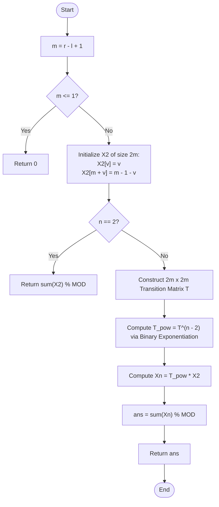

# 💡 Approach — Number of Zigzag Arrays II

| 📄 [Problem](./Problem.md) | 💡 [Approach](./Approach.md) | 🧩 [Solution](./Solution.cpp) | 🚀 [Main](./Main.cpp) |
|:--------------------------:|:-----------------------------:|:------------------------------:|:---------------------:|

---

## 📊 Metadata

---

## 🎯 Core Insight

> [!TIP]
> **Matrix Exponentiation for Large $$n$$:**
> When $$n \le 10^9$$, a linear time complexity $$O(n \cdot m)$$ is far too slow and will trigger a Time Limit Exceeded (TLE) error. However, since the range size $$m = r - l + 1 \le 75$$ is small, the linear transition equations can be structured as a matrix equation:
> 
> $$X_{i+1} = T \cdot X_i$$
> 
> By utilizing binary exponentiation, we can compute the state at index $$n$$ using:
> 
> $$X_n = T^{n-2} \cdot X_2$$
> 
> in $$O(m^3 \log n)$$ time.

---

## 🔩 Step-by-Step Breakdown

**Step 1: Set up the State Vector**
- Let the range size be $$m = r - l + 1$$. The state vector $$X$$ has size $$2m$$:
  - $$X[v]$$ contains the count of sequences ending at index offset $$v$$ where the last transition was **UP** ($$0 \le v < m$$).
  - $$X[m + v]$$ contains the count of sequences ending at index offset $$v$$ where the last transition was **DOWN** ($$0 \le v < m$$).

**Step 2: Base Case (Length 2)**
- Initialize the base state vector $$X_2$$:
  - $$X_2[v] = v$$ (valid options smaller than $$v$$)
  - $$X_2[m + v] = m - 1 - v$$ (valid options larger than $$v$$)

**Step 3: Build the Transition Matrix $$T$$**
- Construct a $$2m \times 2m$$ transition matrix $$T$$:
  - To reach an **UP** transition ending at $$v$$, we must transition from a **DOWN** state ending at $$u$$ where $$u < v$$:
    - $$T[v][m + u] = 1$$ for $$u < v$$.
  - To reach a **DOWN** transition ending at $$v$$, we must transition from an **UP** state ending at $$u$$ where $$u > v$$:
    - $$T[m + v][u] = 1$$ for $$u > v$$.

**Step 4: Compute Matrix Power and Multiplication**
- Compute $$T^{n-2}$$ using binary exponentiation.
- Multiply $$T^{n-2}$$ by $$X_2$$ to get the final state vector $$X_n$$.
- Sum up all elements in $$X_n$$ modulo $$10^9 + 7$$.

---

## 🔄 Mermaid Flowchart

---

## 🧮 Dry Run — Example 1

Input: `n = 3, l = 4, r = 5` $\implies m = 2, 2m = 4$.

### 1. Initialize $$X_2$$

- $$X_2 = [0, 1, 1, 0]^T$$

### 2. Transition Matrix $$T$$
$$
T = \begin{pmatrix}
0 & 0 & 0 & 0 \\
0 & 0 & 1 & 0 \\
0 & 1 & 0 & 0 \\
0 & 0 & 0 & 0
\end{pmatrix}
$$

### 3. Exponentiation for $$n = 3$$
Power is $$n - 2 = 1$$, so we just multiply $$T^1 \cdot X_2$$:
$$
X_3 = T \cdot X_2 = \begin{pmatrix}
0 & 0 & 0 & 0 \\
0 & 0 & 1 & 0 \\
0 & 1 & 0 & 0 \\
0 & 0 & 0 & 0
\end{pmatrix} \cdot \begin{pmatrix} 0 \\ 1 \\ 1 \\ 0 \end{pmatrix} = \begin{pmatrix} 0 \\ 1 \\ 1 \\ 0 \end{pmatrix}
$$

### 4. Summing Elements
- Sum: $$0 + 1 + 1 + 0 = 2$$.

**Final Output:** `2` ✅

---

## 📊 Complexity Analysis

| Metric | Complexity | Reasoning |
| :---: | :---: | :--- |
| 🕐 Time | $$O(m^3 \log n)$$ | Matrix multiplication of size $$2m \times 2m$$ takes $$O(m^3)$$ time. We perform at most $$O(\log n)$$ multiplications. |
| 💾 Space | $$O(m^2)$$ | Storing the transition matrices of size $$2m \times 2m$$ requires $$O(m^2)$$ auxiliary space. |

---

> *"When a problem grows exponentially in size, the power of math allows us to leap over the linear steps of time."*

---

<h3>Happy Coding! 🚀</h3>

