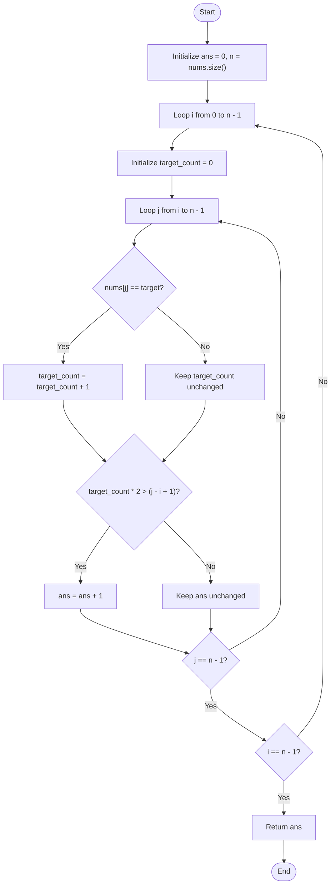

# 💡 Approach — Count Subarrays with Majority Element I

| 📄 [Problem](./Problem.md) | 💡 [Approach](./Approach.md) | 🧩 [Solution](./Solution.cpp) | 🚀 [Main](./Main.cpp) |
|:--------------------------:|:-----------------------------:|:------------------------------:|:---------------------:|

---

## 📊 Metadata

---

## 🎯 Core Insight

> [!TIP]
> **Nested Loops for Small Constraints ($$N \le 1000$$):**
> A subarray has `target` as its majority element if the frequency of `target` in the subarray is strictly greater than half of the subarray's size:
> 
> $$\text{count} > \lfloor \frac{\text{length}}{2} \rfloor \iff \text{count} \times 2 > \text{length}$$
> 
> Because the constraint on the array size is small ($$n \le 1000$$), an $$O(n^2)$$ time complexity brute-force approach is fully acceptable and runs easily within the time limit. We can examine every possible subarray by iterating its start index $$i$$ and end index $$j$$, maintaining the target's frequency.

---

## 🔩 Step-by-Step Breakdown

**Step 1: Loop Through Starting Positions**
- Run an outer loop with variable `i` from `0` to `n - 1`.

**Step 2: Track Target Counts**
- For each starting position `i`, initialize `target_count = 0`.

**Step 3: Expand Subarray**
- Run an inner loop with variable `j` from `i` to `n - 1` to represent the ending index of the subarray:
  - If `nums[j] == target`, increment `target_count`.
  - Calculate the current length of the subarray: `len = j - i + 1`.
  - Check if `target_count * 2 > len`. If yes, increment the final answer.

**Step 4: Return Count**
- Return the final count of valid subarrays.

---

## 🔄 Mermaid Flowchart

---

## 🧮 Dry Run — Example 1

Input: `nums = [1, 2, 2, 3]`, `target = 2`

### Iteration Table

| $$i$$ | $$j$$ | Subarray | `target_count` | `len` | Condition: `target_count * 2 > len` | `ans` Update |
| :---: | :---: | :---: | :---: | :---: | :---: | :---: |
| **0** | **0** | `[1]` | `0` | `1` | `0 > 1` (False) | `0` |
| **0** | **1** | `[1, 2]` | `1` | `2` | `2 > 2` (False) | `0` |
| **0** | **2** | `[1, 2, 2]` | `2` | `3` | `4 > 3` (True) | `1` |
| **0** | **3** | `[1, 2, 2, 3]` | `2` | `4` | `4 > 4` (False) | `1` |
| **1** | **1** | `[2]` | `1` | `1` | `2 > 1` (True) | `2` |
| **1** | **2** | `[2, 2]` | `2` | `2` | `4 > 2` (True) | `3` |
| **1** | **3** | `[2, 2, 3]` | `2` | `3` | `4 > 3` (True) | `4` |
| **2** | **2** | `[2]` | `1` | `1` | `2 > 1` (True) | `5` |
| **2** | **3** | `[2, 3]` | `1` | `2` | `2 > 2` (False) | `5` |
| **3** | **3** | `[3]` | `0` | `1` | `0 > 1` (False) | `5` |

**Final Output:** `5` ✅

---

## 📊 Complexity Analysis

| Metric | Complexity | Reasoning |
| :---: | :---: | :--- |
| 🕐 Time | $$O(n^2)$$ | Two nested loops iterate over all possible pairs of indices $$(i, j)$$, running in quadratic time. |
| 💾 Space | $$O(1)$$ | We only use a few scalar variables, requiring no auxiliary storage. |

---

> *"Simple designs are best when the constraints are small, allowing clarity and correctness to take center stage."*

---

<h3>Happy Coding! 🚀</h3>

