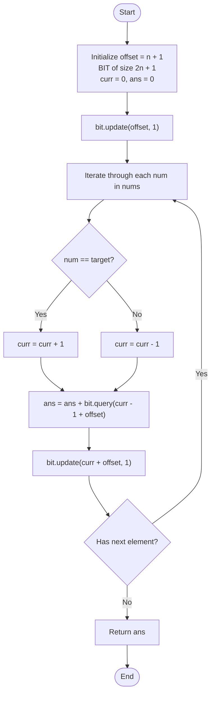

# 💡 Approach — Count Subarrays with Majority Element II

| 📄 [Problem](./Problem.md) | 💡 [Approach](./Approach.md) | 🧩 [Solution](./Solution.cpp) | 🚀 [Main](./Main.cpp) |
|:--------------------------:|:-----------------------------:|:------------------------------:|:---------------------:|

---

## 📊 Metadata

---

## 🎯 Core Insight

> [!TIP]
> **Prefix Sum Transformation + Binary Indexed Tree (BIT):**
> 1. **Transformation:** Let's assign a value of `+1` to every element equal to `target`, and `-1` to all other elements.
> 2. **Condition:** A subarray from index $i$ to $j$ has `target` as the majority element if and only if the sum of this range in our transformed array is strictly positive:
>    
>    $$S[j] - S[i-1] > 0 \iff S[i-1] < S[j]$$
>    
>    where $S$ is the prefix sum array.
> 3. **Counting:** As we iterate through the array and update the running prefix sum $S[j]$, the number of valid subarrays ending at $j$ is the number of previous indices $i-1$ such that $S[i-1] < S[j]$.
> 4. **Efficient Queries:** We can maintain the counts of prefix sums seen so far in a **Binary Indexed Tree (Fenwick Tree)**. Since prefix sums range from $-n$ to $n$, we add an offset of $n + 1$ to map them to the positive index range $[1, 2n + 1]$. This optimizes our query and update operations to $O(\log n)$ each.

---

## 🔩 Step-by-Step Breakdown

**Step 1: Define Fenwick Tree (BIT)**
- Implement a Binary Indexed Tree supporting two operations:
  - `update(idx, val)`: Add `val` to the count at index `idx`.
  - `query(idx)`: Get the prefix sum (total count) from index `1` to `idx`.

**Step 2: Initialize Run State**
- Let `n` be the size of the array. Set `offset = n + 1` to prevent negative indices in the BIT.
- Initialize `curr = 0` (running prefix sum).
- Insert the base case `curr = 0` into the BIT: `update(0 + offset, 1)`. This represents that a prefix sum of 0 has occurred once.

**Step 3: Process Elements and Query BIT**
- Iterate through each number `num` in `nums`:
  - Update `curr`: if `num == target`, `curr += 1`, else `curr -= 1`.
  - Add to the answer the count of previous prefix sums strictly less than the current prefix sum: `ans += query(curr - 1 + offset)`.
  - Record the current prefix sum in the BIT: `update(curr + offset, 1)`.

**Step 4: Return Answer**
- Return the accumulated count `ans` as a `long long` to prevent integer overflow.

---

## 🔄 Mermaid Flowchart

---

## 🧮 Dry Run — Example 1

Input: `nums = [1, 2, 2, 3]`, `target = 2`, `n = 4`, `offset = 5`, `BIT` size = `9`

### 1. Base Case Initialization
- `bit.update(5, 1)` (Prefix sum `0` seen `1` time)

### 2. Execution Loop

| Step | Num | `curr` | Query Index (`curr - 1 + offset`) | `bit.query` Result | `ans` Update | `bit.update` Index (`curr + offset`) |
| :---: | :---: | :---: | :---: | :---: | :---: | :---: |
| **Start** | — | `0` | — | — | `0` | `5` |
| **1** | `1` | `-1` | `3` (prefix sums < -1) | `0` | `0` | `4` |
| **2** | `2` | `0` | `4` (prefix sums < 0) | `1` (from prefix sum -1) | `1` | `5` |
| **3** | `2` | `1` | `5` (prefix sums < 1) | `3` (from -1, 0, 0) | `1 + 3 = 4` | `6` |
| **4** | `3` | `0` | `4` (prefix sums < 0) | `1` (from prefix sum -1) | `4 + 1 = 5` | `5` |

**Final Output:** `5` ✅

---

## 📊 Complexity Analysis

| Metric | Complexity | Reasoning |
| :---: | :---: | :--- |
| 🕐 Time | $$O(n \log n)$$ | We iterate over the array of size $$n$$ once. For each element, we query and update the Fenwick Tree, which takes $$O(\log n)$$ time. |
| 💾 Space | $$O(n)$$ | The Binary Indexed Tree size is $$2n + 1$$, taking linear auxiliary space. |

---

> *"Transforming constraints into a running sum turns a search space of intervals into a structured query of prefixes."*

---

<h3>Happy Coding! 🚀</h3>

